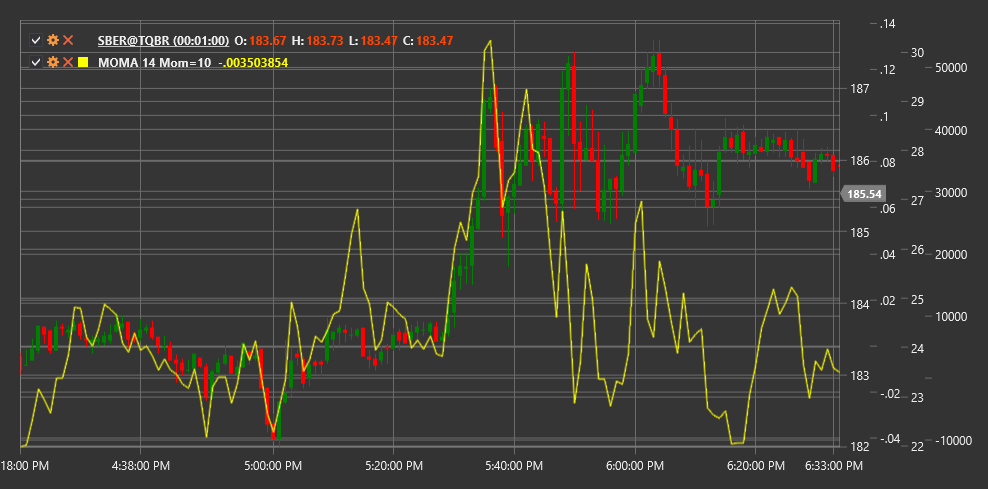

# MOMA

**Impulso de la media móvil (MOMA)** es un indicador técnico que mide la tasa de cambio del precio promedio móvil, combinando los conceptos de impulso y promedios móviles.

Para utilizar el indicador, debe utilizar la clase [MomentumOfMovingAverage](xref:StockSharp.Algo.Indicators.MomentumOfMovingAverage).

## Descripción

El impulso de la media móvil (MOMA) es una combinación de dos indicadores: un indicador de impulso y una media móvil. Primero, se calcula una media móvil de la serie de precios y luego se mide el impulso (tasa de cambio) de esta media móvil.

La idea principal de MOMA es primero suavizar la serie de precios utilizando una media móvil, eliminando así el ruido del mercado, y luego analizar la velocidad y dirección del cambio en esta curva suavizada. Esto permite obtener una señal más clara sobre el cambio de impulso de la tendencia que calcular el impulso directamente a partir del precio.

MOMA ayuda a determinar la fuerza de la tendencia y los posibles puntos de reversión al centrarse en los cambios en la dinámica del promedio móvil, en lugar del precio en sí. Los valores positivos de MOMA indican un impulso promedio móvil ascendente, mientras que los valores negativos indican un impulso descendente.

## Parámetros

El indicador tiene los siguientes parámetros:
- **Length** - período para el cálculo de la media móvil (valor predeterminado: 14)
- **MomentumPeriod** - período para el cálculo del impulso (valor predeterminado: 10)

## Cálculo

El cálculo del impulso de la media móvil implica los siguientes pasos:

1. Calcule el promedio móvil de la serie de precios:
   ```
   MA = SMA(Price, Length)
   ```

2. Calcule el impulso promedio móvil:
   ```
   MOMA = MA[current] - MA[current - MomentumPeriod]
   ```

donde:
- Price - precio (normalmente precio de cierre)
- SMA - media móvil simple
- Length - período de media móvil
- MomentumPeriod - período para el cálculo del impulso

Nota: También se pueden utilizar otros tipos de medias móviles como EMA (media móvil exponencial), WMA (media móvil ponderada), etc., en lugar de SMA.

## Interpretación

El impulso de la media móvil se puede interpretar de la siguiente manera:

1. **Cruces de línea cero**:
   - MOMA cruzar la línea cero de abajo hacia arriba puede verse como una señal alcista, lo que indica el inicio o el fortalecimiento de una tendencia alcista.
   - MOMA cruzar la línea cero de arriba a abajo puede verse como una señal bajista, lo que indica el inicio o el fortalecimiento de una tendencia a la baja.

2. **Valores absolutos**:
   - Los valores positivos altos de MOMA indican un fuerte impulso de promedio móvil ascendente
   - Los valores negativos extremos de MOMA indican un fuerte impulso promedio móvil descendente
   - Los valores cercanos a cero indican que no hay un impulso pronunciado o una tendencia lateral

3. **Divergencias**:
   - Divergencia alcista: el precio forma un nuevo mínimo, mientras que MOMA forma un mínimo más alto
   - Divergencia bajista: el precio forma un nuevo máximo, mientras que MOMA forma un máximo más bajo

4. **Cambio de dirección**:
   - Cuando MOMA cambia la dirección del movimiento (de subir a bajar o viceversa), esto puede indicar un cambio potencial en la tendencia del promedio móvil.
   - Estas reversiones a menudo preceden a cambios en la dirección de los precios.

5. **Confirmación de tendencia**:
   - Los valores positivos de MOMA confirman una tendencia alcista
   - Los valores negativos de MOMA confirman una tendencia a la baja
   - Los valores crecientes de MOMA indican un fortalecimiento de la tendencia actual
   - Los valores decrecientes de MOMA indican un debilitamiento de la tendencia actual

6. **Filtrado de señal**:
   - MOMA se puede utilizar para filtrar señales de otros indicadores
   - Por ejemplo, considere solo señales alcistas cuando MOMA sea positivo y solo señales bajistas cuando MOMA sea negativo.

7. **Selección de parámetros**:
   - Períodos más cortos para Length y MomentumPeriod hacen que MOMA sea más sensible, pero también más propenso a señales falsas
   - Los períodos más largos hacen que MOMA sea más suave, pero pueden generar señales retrasadas



## Véase también

[Impulso](momentum.md)
[SMA](sma.md)
[EMA](ema.md)
[RoC](roc.md)
