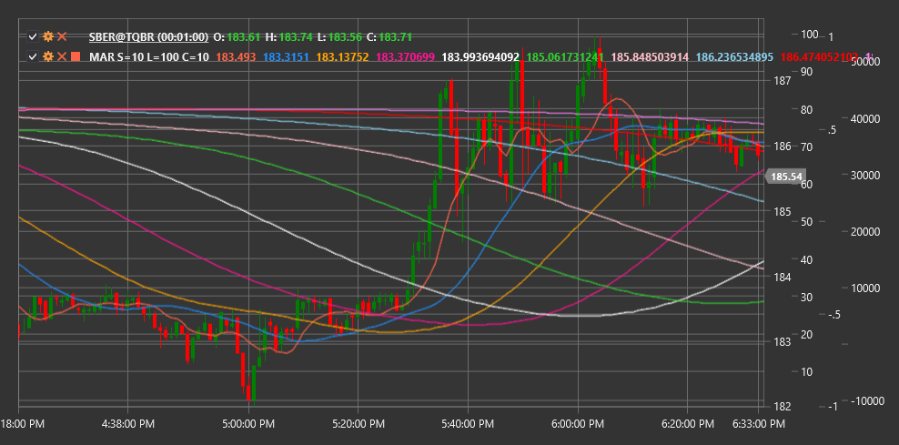

# MAR

**Cinta de medias móviles (MAR)** es un indicador técnico que muestra múltiples promedios móviles con períodos que aumentan progresivamente para visualizar la fuerza y dirección de la tendencia.

Para utilizar el indicador, debe utilizar la clase [MovingAverageRibbon](xref:StockSharp.Algo.Indicators.MovingAverageRibbon).

## Descripción

La cinta de medias móviles (MAR) es un conjunto de múltiples promedios móviles que se muestran en un gráfico en forma de "cinta" o "abanico". Este indicador ayuda a los operadores a visualizar el estado de la tendencia actual y su fuerza de manera más intuitiva que usar uno o dos promedios móviles.

MAR incluye varias medias móviles (normalmente de 5 a 10) con períodos progresivamente crecientes. El intervalo entre periodos puede ser uniforme (por ejemplo, 10, 20, 30, 40...) o exponencial (por ejemplo, 5, 10, 20, 40...).

La idea principal es que el posicionamiento mutuo y la forma de estos promedios móviles pueden proporcionar información valiosa sobre el estado y la fuerza de la tendencia actual y ayudar a identificar posibles puntos de reversión.

## Parámetros

El indicador tiene los siguientes parámetros:
- **ShortPeriod** - período inicial (mínimo) para promedios móviles (valor predeterminado: 10)
- **LongPeriod** - período final (máximo) para promedios móviles (valor predeterminado: 100)
- **RibbonCount** - número de medias móviles en la cinta (valor predeterminado: 10)

## Cálculo

El cálculo de la cinta de medias móviles implica los siguientes pasos:

1. Determine la secuencia de períodos para las medias móviles:
   ```
   Step = (LongPeriod - ShortPeriod) / (RibbonCount - 1)
   Periods = [ShortPeriod, ShortPeriod + Step, ShortPeriod + 2*Step, ..., LongPeriod]
   ```

2. Calcule el promedio móvil para cada período:
   ```
   MAs = [SMA(Precio, Período) para cada Período en Períodos]
   ```

donde:
- Price - precio (normalmente precio de cierre)
- SMA - media móvil simple
- ShortPeriod - período inicial
- LongPeriod - período final
- RibbonCount - número de medias móviles

Nota: Se pueden utilizar otros tipos de medias móviles como EMA (media móvil exponencial), WMA (media móvil ponderada), etc., en lugar de SMA.

## Interpretación

La cinta de medias móviles se puede interpretar de la siguiente manera:

1. **Posicionamiento mutuo de medias móviles**:
   - Cuando todas las líneas están dispuestas en orden ascendente de períodos (la más corta arriba, la más larga abajo), esto indica una fuerte tendencia alcista.
   - Cuando todas las líneas están dispuestas en orden descendente de períodos (la más corta abajo, la más larga arriba), esto indica una fuerte tendencia a la baja.
   - Cuando las líneas se cruzan y no tienen un orden claro, esto indica una tendencia lateral o incertidumbre.

2. **Forma de cinta**:
   - La cinta en expansión (aumentando la distancia entre líneas) indica un fortalecimiento de la tendencia
   - La cinta que se contrae (disminución de la distancia entre líneas) indica un debilitamiento de la tendencia
   - La agrupación apretada de líneas indica consolidación o falta de una tendencia pronunciada

3. **Cruces de media móvil**:
   - El comienzo de las intersecciones de líneas puede indicar un posible cambio de tendencia
   - Cuando las medias móviles cortas comienzan a cruzar a las largas, esto puede ser una señal temprana de un cambio de tendencia.

4. **Ángulo de pendiente de la cinta**:
   - Un ángulo pronunciado indica una fuerte tendencia
   - El ángulo poco profundo indica una tendencia débil
   - La posición horizontal de la cinta indica una tendencia lateral

5. **Posición del precio en relación con la cinta**:
   - Cuando el precio está por encima de toda la cinta, esto confirma una fuerte tendencia alcista.
   - Cuando el precio está por debajo de toda la cinta, esto confirma una fuerte tendencia a la baja.
   - Cuando el precio se mueve dentro de la cinta, esto puede indicar un estado de transición o consolidación.

6. **Estrategias de trading**:
   - Ingrese una posición cuando el precio rebote desde el borde de la cinta en la dirección de la tendencia.
   - Salga de una posición cuando las medias móviles comiencen a cruzarse en la dirección opuesta.
   - Utilice el ancho de la cinta para establecer límites de pérdidas y toma de ganancias



## Véase también

[SMA](sma.md)
[EMA](ema.md)
[MovingAverageCrossover](moving_average_crossover.md)
[GuppyMultipleMovingAverage](guppy_multiple_moving_average.md)
