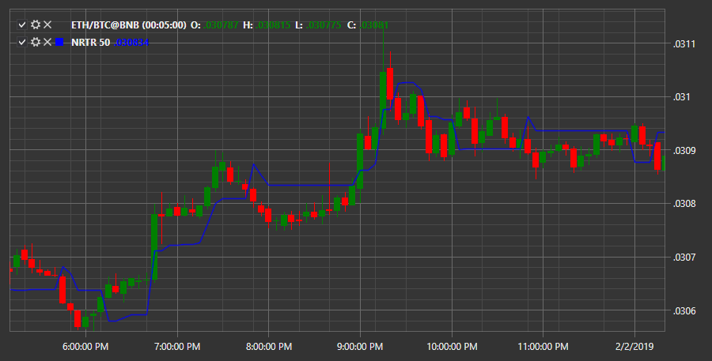

# NRTR

**reversión con seguimiento de Nick Rypock (NRTR)** — la esencia del indicador es que siempre está en el segmento desde los extremos de precios alcanzados. Aquí se implementó la siguiente idea: los pequeños movimientos correctivos contra la tendencia principal deben ignorarse, y el movimiento contra la tendencia principal por encima de algún nivel indica una tendencia inversa.

Para utilizar el indicador, debe utilizar la clase [NickRypockTrailingReverse](xref:StockSharp.Algo.Indicators.NickRypockTrailingReverse).

## Contenido recomendado

[SAR parabólico](parabolic_sar.md)
