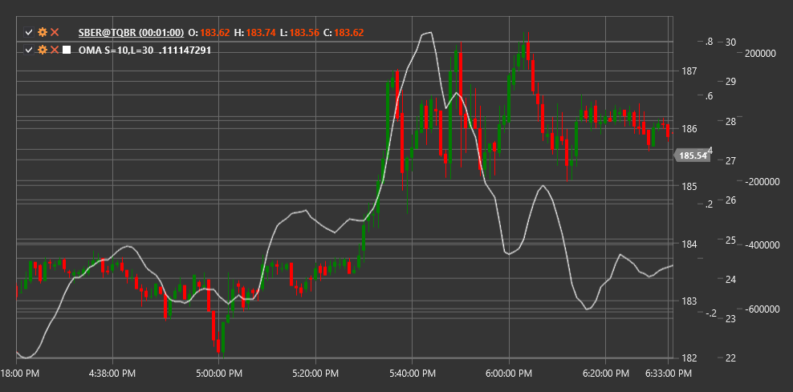

# OMA

**Oscilador de la media móvil (OMA)** es un indicador técnico que mide la diferencia entre dos promedios móviles con diferentes períodos para determinar el impulso y los posibles puntos de reversión.

Para utilizar el indicador, debe utilizar la clase [OscillatorOfMovingAverage](xref:StockSharp.Algo.Indicators.OscillatorOfMovingAverage).

## Descripción

El oscilador de la media móvil (OMA) representa la diferencia entre una media móvil corta y larga. Este indicador ayuda a determinar la fuerza de la tendencia y sus posibles cambios al analizar la relación entre los promedios móviles de diferentes períodos.

OMA funciona según un principio similar a MACD (convergencia/divergencia de medias móviles), pero de una forma más sencilla, ya que no incluye una línea de señal. El indicador oscila alrededor de la línea cero, donde los valores positivos indican que la media móvil corta está por encima de la media móvil larga (estado alcista), y los valores negativos indican que la media móvil corta está por debajo de la media móvil larga (estado bajista).

La principal fortaleza de OMA radica en su capacidad para identificar cambios en el impulso de la tendencia y generar señales de trading basadas en cruces de línea cero y divergencias de precios.

## Parámetros

El indicador tiene los siguientes parámetros:
- **ShortPeriod** - período para la media móvil corta (valor predeterminado: 12)
- **LongPeriod** - período para la media móvil larga (valor predeterminado: 26)

## Cálculo

El cálculo del oscilador de la media móvil implica los siguientes pasos:

1. Calcule la media móvil corta:
   ```
   Short MA = SMA(Price, ShortPeriod)
   ```

2. Calcule la media móvil larga:
   ```
   Long MA = SMA(Price, LongPeriod)
   ```

3. Calcule OMA como la diferencia entre medias móviles cortas y largas:
   ```
   OMA = Short MA - Long MA
   ```

donde:
- Price - precio (normalmente precio de cierre)
- SMA - media móvil simple
- ShortPeriod - período para la media móvil corta
- LongPeriod - período para la media móvil larga

Nota: Se pueden utilizar otros tipos de medias móviles como EMA (media móvil exponencial), WMA (media móvil ponderada), etc., en lugar de SMA.

## Interpretación

El oscilador de la media móvil se puede interpretar de la siguiente manera:

1. **Cruces de línea cero**:
   - OMA cruza la línea cero de abajo hacia arriba (MA corta cruza MA larga de abajo hacia arriba) puede verse como una señal alcista
   - OMA cruza la línea cero de arriba a abajo (MA corta cruza MA larga de arriba a abajo) puede verse como una señal bajista

2. **Valores extremos**:
   - High valores positivos OMA indican que el mercado puede estar sobrecomprado
   - High valores negativos OMA indican que el mercado puede estar sobrevendido
   - Valores extremos suele preceder a correcciones o cambios de tendencia

3. **Divergencias**:
   - Divergencia alcista: el precio forma un nuevo mínimo, mientras que OMA forma un mínimo más alto
   - Divergencia bajista: el precio forma un nuevo máximo, mientras que OMA forma un máximo más bajo
   - Divergencias a menudo precede a cambios de tendencia significativos

4. **Confirmación de tendencia**:
   - Los valores positivos de OMA confirman una tendencia alcista
   - Los valores negativos de OMA confirman una tendencia a la baja
   - El aumento del valor absoluto de OMA indica un fortalecimiento de la tendencia actual

5. **Centerline (0)**:
   - Cuando OMA oscila alrededor de la línea cero, puede indicar la ausencia de una tendencia o consolidación pronunciada

6. **Rate of Change**:
   - XZX0000La pendiente XZX indica la tasa de cambio de tendencia
   - Una pendiente pronunciada indica un rápido cambio de tendencia
   - La pendiente poco profunda indica un cambio de tendencia lento

7. **Combinando con otros indicadores**:
   - OMA se utiliza a menudo en combinación con otros indicadores para confirmar señales
   - Particularmente eficaz cuando se combina con indicadores sobrecompra/sobreventa como RSI o estocástico



## Véase también

[MACD](macd.md)
[MovingAverageCrossover](moving_average_crossover.md)
[SMA](sma.md)
[EMA](ema.md)
