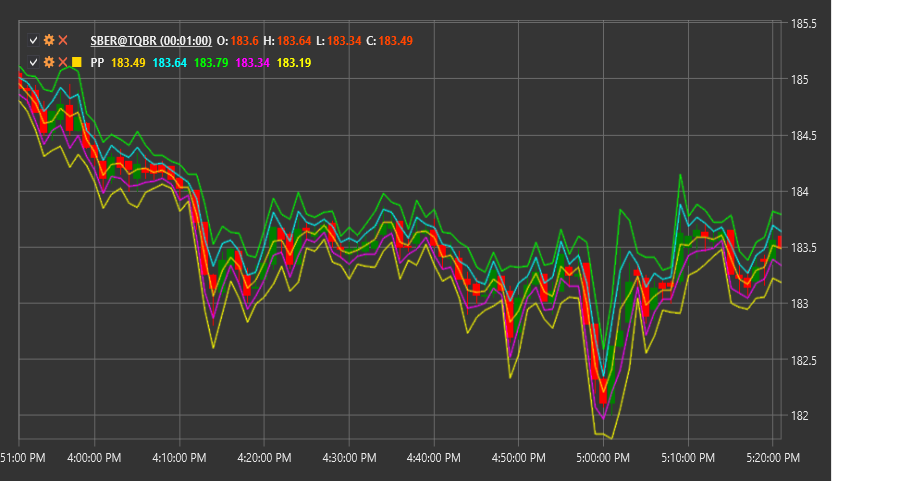

# PP

**Pivot Points (PP)** es un indicador técnico que utiliza precios máximos, mínimos y de cierre anteriores para determinar los posibles niveles de soporte y resistencia para el período comercial actual.

Para utilizar el indicador, debe utilizar la clase [PivotPoints](xref:StockSharp.Algo.Indicators.PivotPoints).

## Descripción

Pivot Points (puntos de pivote) son uno de los métodos más antiguos y utilizados para identificar niveles clave de mercado. El indicador calcula el punto de pivote central (PP) y varios niveles de soporte (S1, S2, S3) y resistencia (R1, R2, R3) basándose en los datos del período anterior.

Originalmente, los operadores en los pisos de intercambio utilizaban Pivot Points para determinar los niveles clave para el día de negociación actual en función de los datos del día anterior. Hoy en día, este método se ha adaptado a varios períodos de tiempo, desde intradiario hasta mensual.

La idea principal detrás de Pivot Points es que el mercado tiende a reaccionar a estos niveles precalculados, usándolos como puntos de reversión o zonas donde puede ocurrir una consolidación. Los operadores utilizan estos niveles para tomar decisiones sobre la entrada y salida del mercado, así como para establecer niveles objetivo y límites de pérdidas.

## Cálculo

Existen varios métodos para calcular Pivot Points, incluidos estándar, Fibonacci, Woodie, Camarilla y DeMark. A continuación se muestra el método de cálculo estándar:

1. Calcule el punto de pivote principal (PP):
   ```
   PP = (High + Low + Close) / 3
   ```

2. Calcule los primeros niveles de resistencia (R1) y soporte (S1):
   ```
   R1 = (2 * PP) - Low
   S1 = (2 * PP) - High
   ```

3. Calcule los segundos niveles de resistencia (R2) y soporte (S2):
   ```
   R2 = PP + (High - Low)
   S2 = PP - (High - Low)
   ```

4. Calcule los terceros niveles de resistencia (R3) y soporte (S3):
   ```
   R3 = High + 2 * (PP - Low)
   S3 = Low - 2 * (High - PP)
   ```

donde:
- High - precio más alto del período anterior
- Low - precio más bajo del período anterior
- Close - precio de cierre del período anterior

## Interpretación

Pivot Points se puede interpretar de la siguiente manera:

1. **Main Pivot Point (PP)**:
   - PP sirve como referencia principal para determinar el sentimiento general del mercado.
   - Si el precio está por encima de PP, indica un sentimiento alcista.
   - Si el precio está por debajo de PP, indica un sentimiento bajista.
   - PP también puede servir como nivel de soporte o resistencia.

2. **Niveles de resistencia (R1, R2, R3)**:
   - Estos niveles representan zonas de resistencia potenciales en un mercado alcista.
   - Una ruptura de un nivel puede conducir a un movimiento continuo al siguiente nivel
   - Un rebote desde un nivel puede provocar una reversión a la baja

3. **Niveles de soporte (S1, S2, S3)**:
   - Estos niveles representan zonas de soporte potenciales en un mercado bajista.
   - Una ruptura de un nivel puede conducir a un movimiento continuo al siguiente nivel
   - Un rebote desde un nivel puede provocar una reversión al alza

4. **Estrategias de trading**:
   - **Operativa de rebote**: Ingrese una posición al rebotar en un nivel de soporte o resistencia
   - **Operativa de ruptura**: Ingrese una posición después de una ruptura de nivel confirmada
   - **Operativa en rango**: Compre en niveles de soporte y venda en niveles de resistencia
   - **Definición de objetivos**: Utilice el siguiente nivel como objetivo de obtención de beneficios
   - **Colocación de stop-loss**: Coloque stop-loss más allá de los niveles correspondientes

5. **Combinando con otros indicadores**:
   - Pivot Points se utilizan a menudo en combinación con otros indicadores técnicos para confirmar señales.
   - Particularmente efectivo cuando se combina con indicadores de impulso (RSI, estocástico) e indicadores de tendencia (MA, MACD)

6. **Marcos temporales**:
   - Los Pivot Points diarios se calculan en función del día de negociación anterior.
   - Los Pivot Points semanales se calculan en función de la semana anterior
   - Los Pivot Points mensuales se calculan en función del mes anterior
   - La selección del plazo depende del estilo de negociación y del horizonte temporal.



## Véase también

[FibonacciRetracement](fibonacci_retracement.md)
