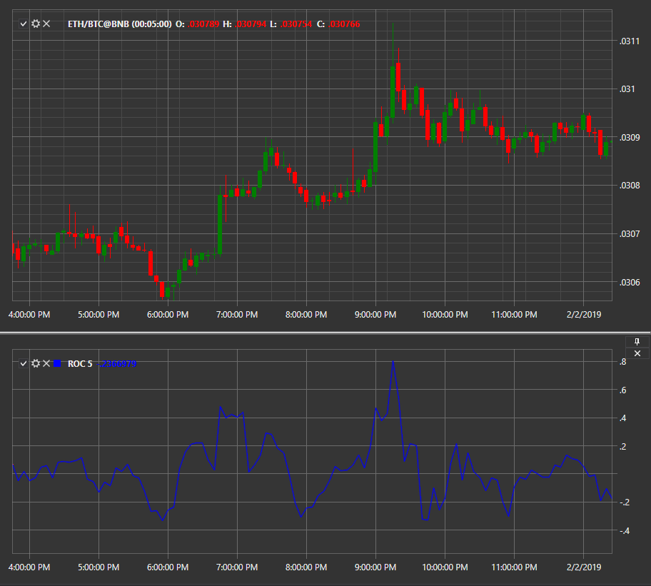

# RoC

El indicador **Rate of Change (RoC)** muestra la diferencia entre el precio actual y el precio de n velas atrás. 

Para utilizar el indicador, debe utilizar la clase [RateOfChange](xref:StockSharp.Algo.Indicators.RateOfChange). 

## Contenido recomendado

[RSI](rsi.md)
