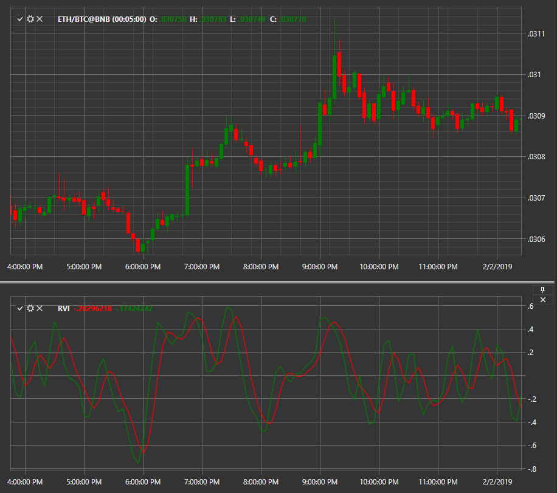

# RVI

El indicador **Relative Vigor Index (RVI, relative energy index)** compara el precio con un rango de precios específico y proporciona una indicación sobre cierta fuerza del movimiento del precio. Los valores más altos de RVI indican un aumento en la fuerza de la tendencia, mientras que los valores más bajos indican una disminución de la tendencia. 

Para utilizar el indicador, debe utilizar la clase [RelativeVigorIndex](xref:StockSharp.Algo.Indicators.RelativeVigorIndex). 

