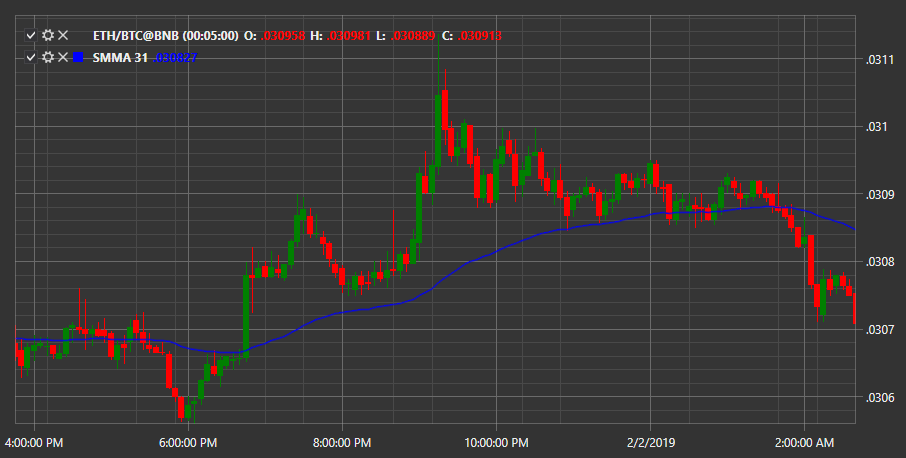

# media móvil suavizada

**Media móvil suavizada (SMA)** - el indicador muestra la dirección del precio promedio suavizado durante un período de tiempo determinado.

Para utilizar el indicador, debe utilizar la clase [SmoothedMovingAverage](xref:StockSharp.Algo.Indicators.SmoothedMovingAverage). 

## Contenido recomendado

[Desviación estándar](standard_deviation.md)
