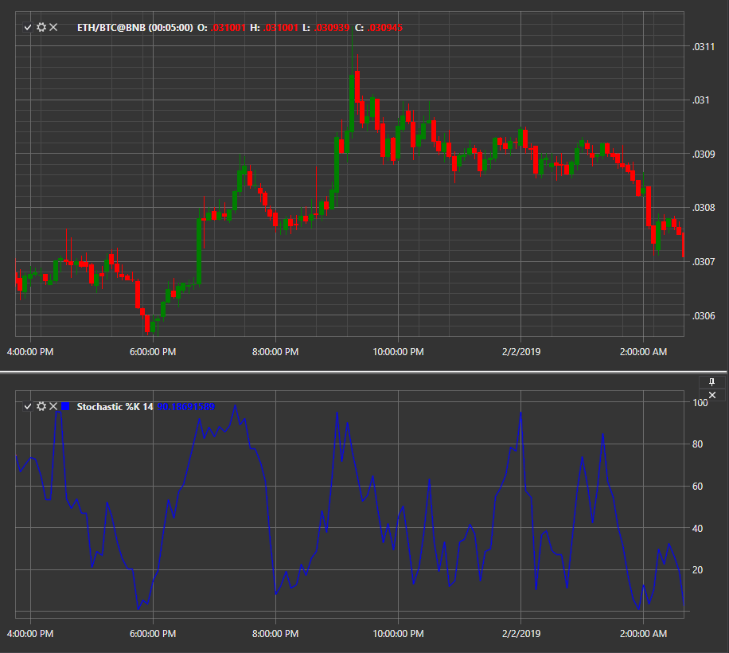

# Oscilador estocástico %K

**Oscilador estocástico %K** es un componente del oscilador estocástico que muestra la posición actual del precio de cierre en relación con el rango de precios durante el período seleccionado. El indicador fue desarrollado por George Lane a finales de los años cincuenta.

Para utilizar el indicador, utilice la clase [StochasticK](xref:StockSharp.Algo.Indicators.StochasticK).

## Descripción

Oscilador estocástico %K se basa en la observación de que durante las tendencias alcistas, los precios de cierre generalmente se concentran más cerca del límite superior del rango de precios, mientras que durante las tendencias bajistas tienden a concentrarse más cerca del límite inferior.

%K es la línea "rápida" del oscilador estocástico y es el componente principal utilizado para calcular la línea %D, que es una media móvil de %K.

El oscilador oscila entre 0 y 100:

- Los valores superiores a 80 suelen indicar un mercado sobrecomprado.
- Los valores por debajo de 20 indican un mercado sobrevendido.
- Crossovers de las líneas %K y %D se pueden utilizar como señales de entrada o salida.

## Parámetros

- **Length** - período utilizado para calcular el rango de precios, es decir, los máximos y mínimos. El valor predeterminado común es 14.

## Cálculo

Fórmula para calcular %K:

```
%K = 100 * ((Close - Low(Length)) / (High(Length) - Low(Length)))
```

donde:

- Close - precio de cierre actual.
- Low(Length): precio mínimo durante el período Length.
- High(Length): precio máximo durante el período Length.

En el oscilador estocástico completo, la línea %D se calcula como un promedio móvil simple de %K durante el período especificado, generalmente 3:

```
%D = SMA(%K, 3)
```



## Véase también

[Oscilador estocástico](stochastic_oscillator.md)
