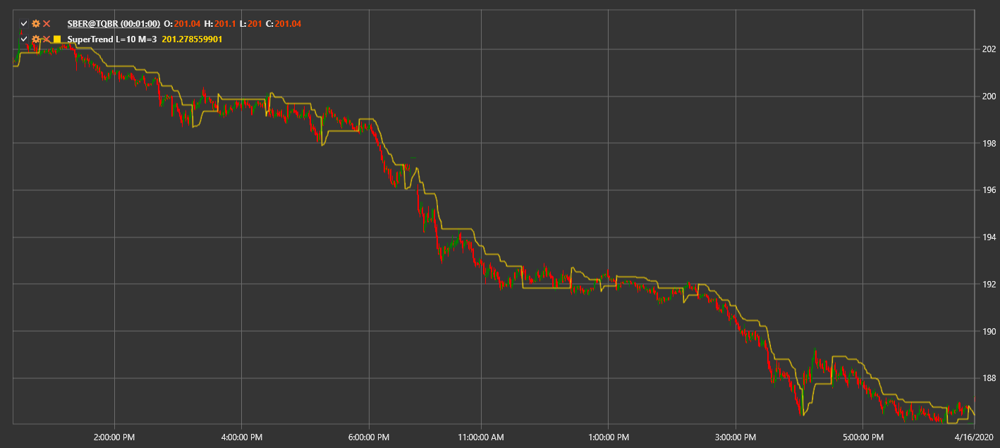

# SuperTrend

**El indicador SuperTrend** es un indicador de seguimiento de tendencias basado en el Average True Range (ATR). Ayuda a identificar la dirección de la tendencia actual y los posibles puntos de reversión.

Para utilizar el indicador, se debe utilizar la clase [SuperTrend](xref:StockSharp.Algo.Indicators.SuperTrend).

## Descripción

SuperTrend se construye utilizando el precio promedio y el valor ATR. La línea del indicador cambia de arriba del precio a abajo (y viceversa) cuando cambia la tendencia. De esta manera, SuperTrend resalta visualmente la tendencia actual hasta que el precio cruza la línea del indicador.

## Parámetros

- **ATR Length**: el período utilizado para el cálculo de ATR.
- **Multiplier**: el factor que define en qué medida se compensa la línea con respecto al precio promedio.

## Cálculo

1. Calcule ATR durante el período elegido.
2. Calcule dos límites:
   ```
   UpperBand = (High + Low) / 2 + Multiplier * ATR
   LowerBand = (High + Low) / 2 - Multiplier * ATR
   ```
3. SuperTrend inicialmente es igual a una de las bandas dependiendo de la tendencia actual.
4. Si el precio de cierre cruza la línea SuperTrend, la dirección de la tendencia cambia y la línea se mueve hacia el lado opuesto.



## Véase también

[ATR](atr.md)
[Parabolic SAR](parabolic_sar.md)
