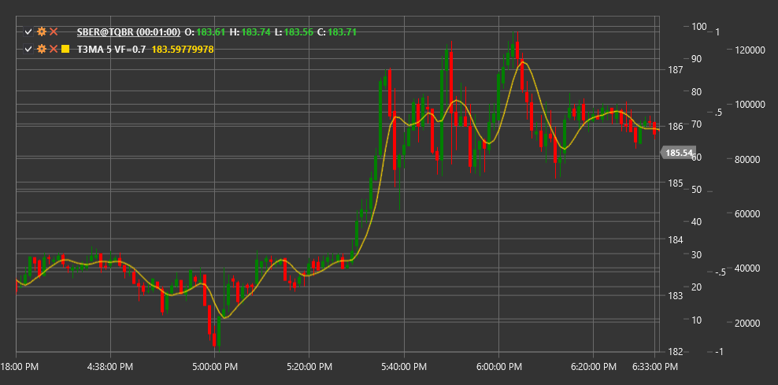

# T3MA

**Media móvil T3 (T3MA)** es un tipo avanzado de media móvil desarrollado por Tim Tillson. T3 representa una media móvil exponencial tres veces suavizada (EMA) con un factor de volumen, lo que la hace más suave y menos propensa a señales falsas en comparación con las medias móviles tradicionales.

Para utilizar el indicador, debe utilizar la clase [T3MovingAverage](xref:StockSharp.Algo.Indicators.T3MovingAverage).

## Descripción

La media móvil T3 fue desarrollada para eliminar los inconvenientes de los promedios móviles tradicionales, como el retraso y las señales falsas. Mediante un suavizado múltiple y un factor de volumen ajustable, T3MA proporciona una curva más suave que sigue con mayor precisión la tendencia del precio.

Principales ventajas de T3MA:
- Menos retraso en comparación con las medias móviles ordinarias
- Curva más suave con menos señales falsas
- Adaptabilidad a diversas condiciones del mercado gracias al factor de volumen ajustable

T3MA se puede utilizar para:
- Determinar la dirección de la tendencia
- Encontrar puntos de entrada y salida cuando el precio cruza la línea del indicador
- Creación de sistemas de negociación basados en cruces de múltiples T3MA con diferentes períodos

## Parámetros

- **Factor de volumen**: factor de volumen que determina el grado de suavizado (normalmente un valor entre 0 y 1, el valor recomendado es 0,7).
- **Longitud** - período de cálculo, similar al período de las medias móviles ordinarias.

## Cálculo

El cálculo de la media móvil T3 se realiza en varios pasos:

1. Calcule seis medias móviles exponenciales consecutivas con el mismo período:
   ```
   EMA1 = EMA(Price, Length)
   EMA2 = EMA(EMA1, Length)
   EMA3 = EMA(EMA2, Length)
   EMA4 = EMA(EMA3, Length)
   EMA5 = EMA(EMA4, Length)
   EMA6 = EMA(EMA5, Length)
   ```

2. Calcule T3 en función de los EMA obtenidos y el factor de volumen:
   ```
   c1 = -VolumeFactor^3
   c2 = 3 * VolumeFactor^2 + 3 * VolumeFactor^3
   c3 = -6 * VolumeFactor^2 - 3 * VolumeFactor - 3 * VolumeFactor^3
   c4 = 1 + 3 * VolumeFactor + VolumeFactor^3 + 3 * VolumeFactor^2

   T3 = c1 * EMA6 + c2 * EMA5 + c3 * EMA4 + c4 * EMA3
   ```

Cuando VolumeFactor = 0, T3 se vuelve equivalente a EMA3 (triple EMA). Cuando VolumeFactor = 1, T3 se suaviza al máximo.



## Véase también

[EMA](ema.md)
[DEMA](dema.md)
[TEMA](tema.md)
