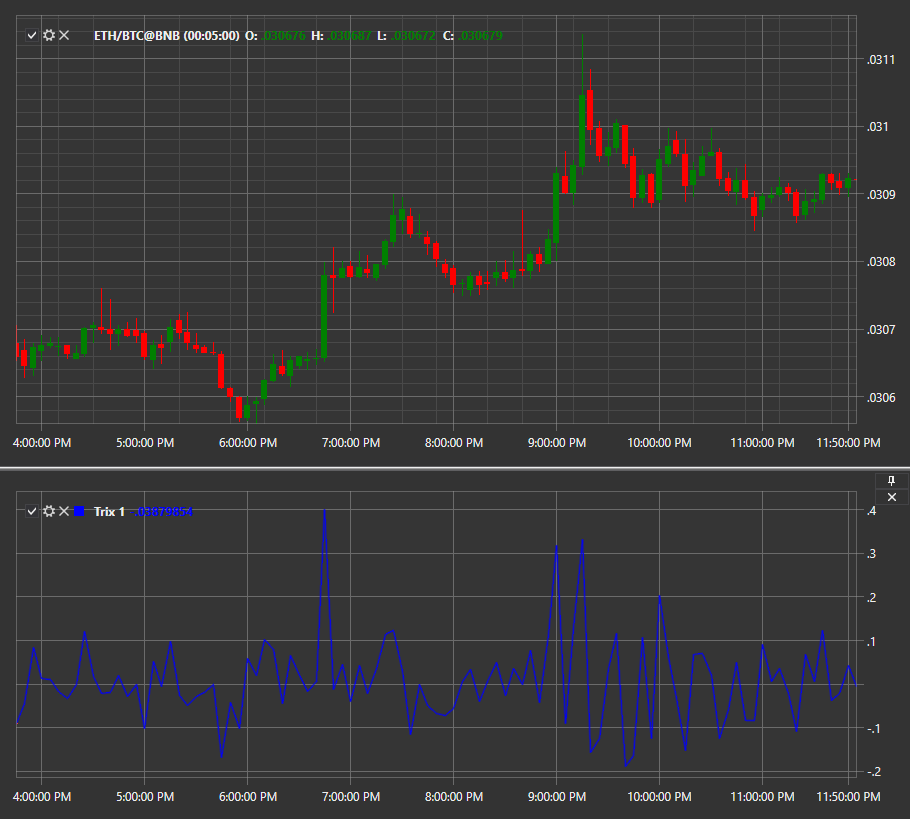

# TRIX

**TRIX** es un oscilador utilizado para determinar mercados de sobreventa y sobrecompra o como indicador de impulso. Como muchos osciladores, TRIX oscila alrededor de la línea cero. Cuando se utiliza como oscilador, un valor positivo indica un mercado de sobrecompra y un valor negativo indica un mercado de sobreventa. Cuando se utiliza TRIX como indicador de impulso, un valor positivo indica un aumento del impulso y un valor negativo indica una disminución del impulso. 

Para utilizar el indicador, debe utilizar la clase [Trix](xref:StockSharp.Algo.Indicators.Trix). 

## Contenido recomendado

[Valle](trough.md)
