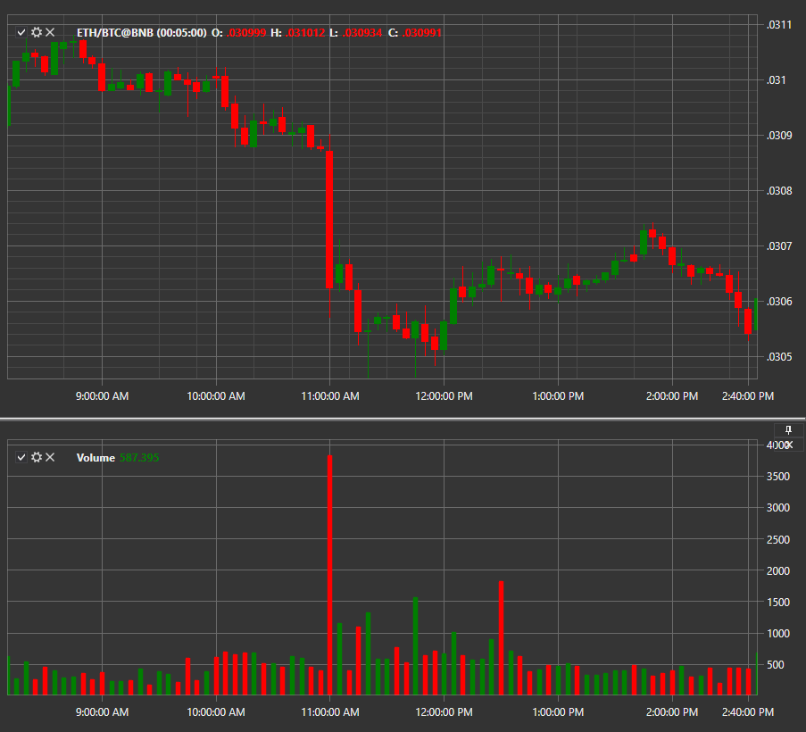

# Volume

El indicador **Candle volume** muestra el volumen de la vela. 

Para utilizar el indicador, debe utilizar la clase [VolumeIndicator](xref:StockSharp.Algo.Indicators.VolumeIndicator). 

## Contenido recomendado

[Volume Profile](volume_profile.md)
