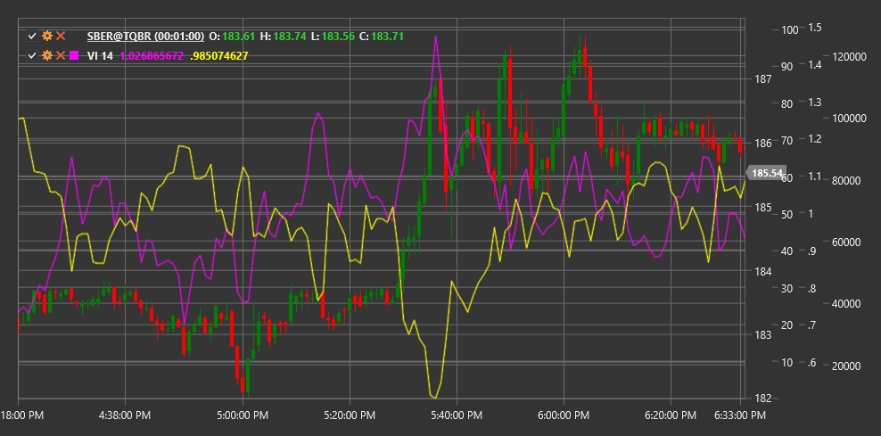

# VI

**Indicador Vortex (VI)** es un indicador técnico desarrollado por Etienne y Julia Boisse en 2009. El indicador consta de dos líneas, VI+ y VI-, que muestran el movimiento de precios al alza y a la baja, lo que ayuda a identificar el comienzo de nuevas tendencias y confirmar las existentes.

Para utilizar el indicador, debe utilizar la clase [VortexIndicator](xref:StockSharp.Algo.Indicators.VortexIndicator).

## Descripción

El indicador Vortex está inspirado en los principios del movimiento de vórtice de la naturaleza y tiene como objetivo reflejar la naturaleza cíclica de los movimientos del mercado. Consta de dos líneas:

- **VI+** (indicador positivo Vortex): mide el movimiento ascendente del precio
- **VI-** (indicador Vortex negativo): mide el movimiento de precios a la baja

Señales indicadoras principales:
- Compre cuando VI+ cruce VI- de abajo hacia arriba
- Vender cuando VI- cruza VI+ de abajo hacia arriba
- El grado de separación entre las líneas indica la fuerza de la tendencia.

El indicador Vortex es particularmente útil para:
- Determinando el inicio de nuevas tendencias.
- Evaluar la fuerza de una tendencia existente
- Identificar posibles puntos de reversión

## Parámetros

- **Length**: período de cálculo, que normalmente utiliza un valor de 14.

## Cálculo

El cálculo del indicador Vortex se realiza en varios pasos:

1. Calcular el movimiento positivo y negativo:
   ```
   VM+ = |Current High - Previous Low|
   VM- = |Current Low - Previous High|
   ```

2. Calcular el rango verdadero:
   ```
   TR = Max(High - Low, |High - Previous Close|, |Low - Previous Close|)
   ```

3. Valores Sum VM+ y VM- durante el período Length:
   ```
   Sum_VM+ = Sum(VM+, Length)
   Sum_VM- = Sum(VM-, Length)
   ```

4. Sumar el rango verdadero durante el período Length:
   ```
   Sum_TR = Sum(TR, Length)
   ```

5. Calcule los valores VI+ y VI- normalizados:
   ```
   VI+ = Sum_VM+ / Sum_TR
   VI- = Sum_VM- / Sum_TR
   ```

El cruce de estas dos líneas genera señales de trading: cuando VI+ sube por encima de VI-, indica una tendencia alcista y, a la inversa, cuando VI- sube por encima de VI+, indica una tendencia bajista.



## Véase también

[ADX](adx.md)
[DMI](dmi.md)
