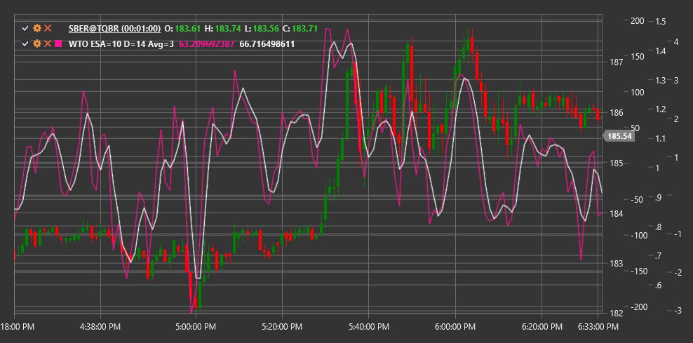

# WTO

**Oscilador de tendencia de onda (WTO)** es un indicador técnico desarrollado para identificar niveles de mercado de sobrecompra y sobreventa, así como para detectar fluctuaciones cíclicas de precios. WTO combina elementos de canales y osciladores, lo que lo convierte en una herramienta eficaz para identificar el impulso del mercado y posibles puntos de reversión.

Para utilizar el indicador, debe utilizar la clase [WaveTrendOscillator](xref:StockSharp.Algo.Indicators.WaveTrendOscillator).

## Descripción

Oscilador de tendencia de onda está diseñado para filtrar el ruido del mercado y resaltar los movimientos de precios primarios. El indicador oscila alrededor de la línea cero, creando patrones de ondas que se correlacionan con movimientos cíclicos de precios.

Características clave de WTO:
- Oscilaciones alrededor de la línea cero, donde los valores positivos indican una tendencia al alza y los valores negativos indican una tendencia a la baja
- Niveles de sobrecompra (normalmente por encima de +60) y niveles de sobreventa (normalmente por debajo de -60)
- Capacidad para filtrar el ruido de los precios y resaltar los movimientos primarios.

Señales indicadoras clave:
- Cruce de línea cero (cambio de dirección de tendencia)
- Salir de zonas sobrecompra/sobreventa
- Divergencias entre WTO y el precio (posibles reversiones)
- Patrones de ondas específicos

## Parámetros

- **Período de ESA** - Período EMA para calcular el valor ESA (normalmente 10)
- **Período de desviación** - período para calcular la desviación (normalmente 21)
- **Período medio** - período para calcular el promedio del oscilador final (normalmente 4)

## Cálculo

El cálculo de Oscilador de tendencia de onda implica varios pasos:

1. Calcular precio típico:
   ```
   AP = (High + Low + Close) / 3
   ```

2. Cree un primer valor de medición suavizado y absoluto:
   ```
   ESA = EMA(AP, EsaPeriod)
   D = EMA(Abs(AP - ESA), DPeriod)
   ```

3. Calcula la primera línea del oscilador:
   ```
   CI = (AP - ESA) / (0.015 * D)
   ```

4. Suaviza el oscilador para obtener el valor final WTO:
   ```
   WTO = EMA(CI, AveragePeriod)
   ```

Los valores típicos de los parámetros del indicador son: EsaPeriod = 10, DPeriod = 21, AveragePeriod = 4, pero se pueden adaptar a diferentes marcos temporales e instrumentos.



## Véase también

[MACD](macd.md)
[Oscilador estocástico](stochastic_oscillator.md)