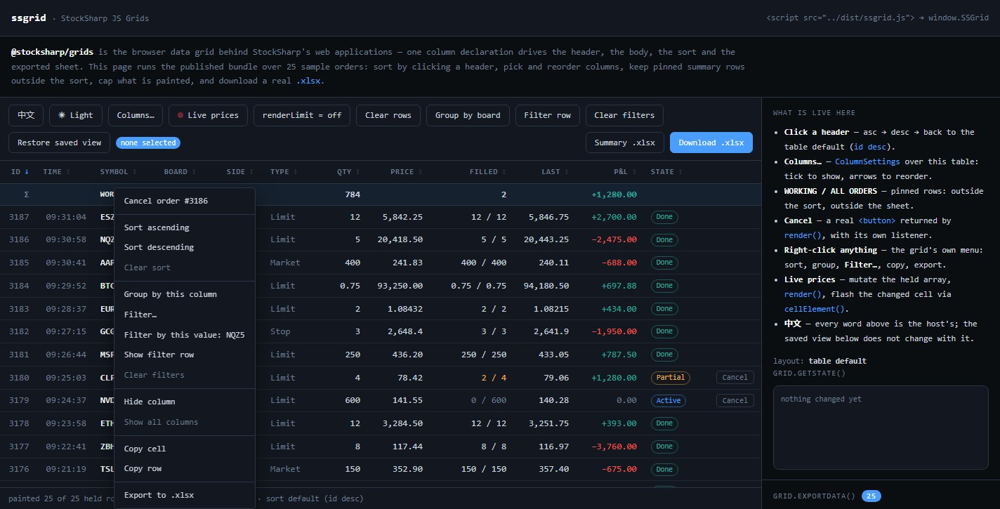

# DataGrid

`DataGrid<TRow>` construye una tabla en el navegador a partir de un conjunto de declaraciones `GridColumn<TRow>`. Cada declaración define el encabezado, el valor mostrado, la ordenación, el filtrado, la clase CSS y el valor de exportación, de modo que estas representaciones permanecen sincronizadas cuando cambia el conjunto de columnas.

## Crear una tabla

`DataGrid` vacía los elementos `head` y `body` proporcionados y, a continuación, administra su contenido. Ambas secciones deben existir en el marcado:

```html
<table id="orders" class="orders-grid">
  <thead></thead>
  <tbody></tbody>
</table>
```

```ts
import {
  DataGrid,
  GridPinnedPlacements,
  SortDirections,
} from '@stocksharp/grids';

interface Order {
  id: number;
  symbol: string;
  side: 'buy' | 'sell';
  price: number;
  volume: number;
  mercado: string;
}

const table = document.querySelector<HTMLTableElement>('#orders')!;
const grid = new DataGrid<Order>({
  head: table.tHead!,
  body: table.tBodies[0],
  columns: [
    { key: 'id', header: 'N.º', value: order => order.id, filter: 'number', exportable: true },
    { key: 'symbol', header: 'Instrumento', value: order => order.symbol, filter: 'text', exportable: true },
    {
      key: 'side',
      header: 'Lado',
      value: order => order.side,
      text: order => order.side === 'buy' ? 'Compra' : 'Venta',
      render: order => order.side === 'buy' ? 'Compra' : 'Venta',
      cellClass: order => order.side === 'buy' ? 'side-buy' : 'side-sell',
      exportValue: order => order.side === 'buy' ? 'Compra' : 'Venta',
      filter: 'set',
      exportable: true,
    },
    { key: 'price', header: 'Precio', value: order => order.price, filter: 'number', exportable: true },
    { key: 'volume', header: 'Volumen', value: order => order.volume, filter: 'number', exportable: true },
    { key: 'mercado', header: 'Régimen de negociación', value: order => order.mercado, filter: 'set', exportable: true },
  ],
  defaultSort: { col: 'id', dir: SortDirections.Desc },
  rowKey: order => String(order.id),
  emptyText: 'No hay órdenes',
  locale: 'es-ES',
  reorderable: true,
  filtersVisible: true,
  selection: 'multi',
  selectedClass: 'is-selected',
  contextMenu: true,
  pinnedRows: () => [{
    key: 'total',
    className: 'grid-total',
    place: GridPinnedPlacements.Bottom,
    cells: [
      { content: '', className: '' },
      { content: 'Total', className: 'grid-total-label' },
      { content: '', className: '' },
      { content: '', className: '' },
      { content: '150', className: 'grid-total-value' },
      { content: '', className: '' },
    ],
  }],
});

const orders: Order[] = [
  { id: 101, symbol: 'SBER', side: 'buy', price: 312.45, volume: 100, mercado: 'TQBR' },
  { id: 102, symbol: 'GAZP', side: 'sell', price: 164.18, volume: 50, mercado: 'TQBR' },
];

grid.setRows(orders);
```

`rowKey` debe devolver una clave única y estable. La cuadrícula la utiliza para conservar la selección después de volver a renderizar y para localizar elementos mediante `rowElement()` y `cellElement()`.

## Descripción de una columna

Campos principales de `GridColumn<TRow>`:

- `key`: identificador permanente de la columna;
- `header`: encabezado ya localizado;
- `value(row)`: valor utilizado para ordenar y, de forma predeterminada, para mostrar y exportar;
- `render(row)`: cadena o nodo DOM para la celda;
- `text(row)`: representación textual del valor para grupos, filtros de conjunto y el menú contextual;
- `cellClass(row)` y `bindCell(td, row)`: estilo y controladores de la celda;
- `filter`: tipo de filtro: `text`, `number` o `set`;
- `exportable` y `exportValue(row)`: inclusión de la columna y valor independiente para el archivo `.xlsx`.

Si `render()` devuelve un `Node` o `DocumentFragment`, el componente lo añade a la celda como DOM y no como una cadena HTML. Esto permite crear botones de forma segura y asignarles controladores mediante `addEventListener`.

## Ordenación, filtros y agrupación

Al hacer clic en el encabezado, la ordenación recorre el ciclo «ascendente → descendente → orden predeterminado». Los valores vacíos permanecen al final en ambas direcciones. La comparación de texto utiliza `Intl.Collator` para el idioma indicado en `locale`; si no se especifica este parámetro, se utiliza el idioma del documento.

Los filtros rápidos se muestran en una fila debajo de los encabezados cuando se define `filtersVisible: true`. La interfaz de programación acepta objetos serializables:

```ts
grid.setFilter('symbol', { op: 'startsWith', text: 'SB' });
grid.setFilter('price', { op: 'between', min: 300, max: 320 });
grid.setFilter('mercado', { op: 'anyOf', values: ['TQBR', 'TQTF'] });

const rowsAfterFilters = grid.filteredRows();
grid.clearFilters();
```

Están disponibles las operaciones `contains`, `notContains`, `startsWith`, `endsWith`, `eq`, `ne`, `gt`, `ge`, `lt`, `le`, `between`, `anyOf`, `noneOf`, `empty` y `notEmpty`. Un objeto de filtro vacío equivale a no aplicar ningún filtro.

La agrupación admite un nivel. Las filas de cada grupo conservan la ordenación seleccionada y los grupos pueden contraerse:

```ts
grid.groupBy('mercado');
grid.toggleGroup('TQBR');
grid.groupBy(null);
```

## Menú contextual y cuadro de diálogo de filtro



Cuando se define `contextMenu: true`, el `GridContextMenu` integrado ofrece ordenación, agrupación, filtrado por valor, ocultación y restauración de columnas, copia de una celda o fila y exportación a `.xlsx`. El objeto `contextMenu` permite cambiar las clases CSS, los textos y la lista de acciones:

```ts
contextMenu: {
  classes: { menu: 'orders-menu', item: 'orders-menu-item' },
  labels: {
    sortAsc: 'Orden ascendente',
    sortDesc: 'Orden descendente',
    filterRule: 'Configurar filtro…',
    filterByValue: value => `Conservar el valor: ${value}`,
  },
  items: (context, defaults) => context.row
    ? [
        {
          label: `Cancelar la orden n.º ${context.row.id}`,
          run: () => cancelOrder(context.row!.id),
        },
        {},
        ...defaults,
      ]
    : defaults,
}
```

Los campos de `labels` son parciales: los textos no especificados conservan sus valores predeterminados en inglés. Para obtener una interfaz completamente en español, la aplicación debe proporcionar todos los textos visibles de `GridMenuLabels` y `GridFilterDialogLabels`.


`GridFilterDialog` se abre desde el menú o mediante el método `openFilterDialog(key, x, y)`. A diferencia de la fila de filtros rápidos, permite elegir el operador y su operando. Para el filtro `set`, el cuadro de diálogo muestra la lista de valores realmente presentes. En un momento dado no puede haber más de un cuadro de diálogo integrado y un menú contextual abiertos en la página.

Los componentes del menú y del cuadro de diálogo crean el marcado y asignan los nombres de las clases, pero no incluyen un diseño listo para usar. La aplicación debe definir las clases estándar `grid-menu*` y `grid-filter-dialog*` o proporcionar las suyas mediante `classes`.

Las clases de bajo nivel también se exportan desde el paquete. `GridContextMenu.open(items, x, y)` muestra un conjunto de elementos `GridMenuItem`, donde un objeto vacío actúa como separador, `disabled` desactiva la acción y `checked` marca el elemento. En `GridFilterDialog.open(options, commit)`, `options.header` establece el encabezado de la columna; las demás opciones especifican el tipo de filtro, la condición actual, las opciones de valores y las coordenadas. La función `commit` recibe un nuevo `GridFilter` o `null` cuando se borra el filtro. Ambas clases tienen una propiedad `isOpen` y un método `close()`. Normalmente no es necesario crearlas manualmente: `DataGrid` las administra mediante el parámetro `contextMenu` y el método `openFilterDialog()`.

## Estado y selección de filas

`getState()` devuelve un objeto normal compatible con JSON que contiene el orden y las columnas ocultas, la ordenación, los filtros, la agrupación, los grupos contraídos y la visibilidad del encabezado y de la fila de filtros:

```ts
const grid = new DataGrid<Order>({
  // Otros parámetros
  onStateChange: state => {
    localStorage.setItem('orders-grid', JSON.stringify(state));
  },
});

const saved = localStorage.getItem('orders-grid');
if (saved)
  grid.setState(JSON.parse(saved));
```

Las claves de columna desconocidas se ignoran durante la restauración, y las columnas nuevas que no aparecen en el orden guardado se añaden después de las enumeradas. `setState()` no llama a `onStateChange`, por lo que la carga no vuelve a guardar el estado.

La selección de filas no forma parte de `GridState`. Si necesita restaurarla, guarde por separado las claves de `onSelectionChange` y páselas a `setSelection(keys)`.

## Datos en tiempo real y exportación

`setRows(rows)` reemplaza el conjunto de filas y vuelve a renderizar la tabla. El componente conserva una referencia al conjunto proporcionado, por lo que puede llamar a `render()` después de modificar los objetos. Para una actualización puntual, utilice `cellElement(rowKey, columnKey)` y, para buscar una fila, `rowElement(rowKey)`.

`renderLimit` limita únicamente el número de filas en el DOM. El filtrado, la ordenación y la exportación siguen utilizando el conjunto completo. `afterRender()` se llama después de cada renderización posterior y resulta adecuado, por ejemplo, para renovar las suscripciones de los instrumentos que están visibles.

Las filas fijadas que devuelve `pinnedRows()` se vuelven a leer en cada renderización y no participan en la ordenación, la selección ni la exportación. El método `exportData()` devuelve los encabezados y las filas sin descargar ningún archivo, mientras que `download(baseName, sheetName)` crea el archivo `.xlsx`.

## Localización y destrucción de la instancia


El paquete no traduce por sí mismo los encabezados ni los valores. La aplicación proporciona los valores localizados de `header`, `emptyText`, `text`, `groupHeader` y los textos del menú y del cuadro de diálogo. El estado almacena las claves y los valores originales, por lo que puede transferirse a una nueva instancia después de cambiar el idioma.

Antes de reemplazar una instancia, llame a `destroy()`. Este método elimina el controlador `Ctrl+C` del documento y cierra los menús y cuadros de diálogo abiertos:

```ts
const state = grid.getState();
grid.destroy();

const localizedGrid = createSpanishGrid();
localizedGrid.setState(state);
```

## Véase también

- [Cuadrículas JavaScript](../grids.md)
- [TableSort](table_sort.md)
- [TableExport](table_export.md)
- [ColumnSettings](column_settings.md)
- [Demostración en línea de JS-Grids](https://stocksharp.github.io/JS-Grids/demo/)
