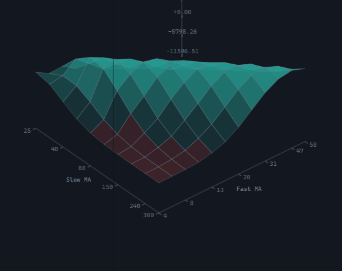

# Superficie de optimización

`SurfaceWidget` muestra los resultados de una búsqueda de parámetros como un paisaje tridimensional: una métrica sobre dos ejes discretos, donde el valor de la métrica determina tanto la altura como el color. El control acepta los mismos datos que el [mapa de calor de optimización](optimization_heatmap.md), por lo que un mismo conjunto de resultados puede presentarse como mapa plano, como superficie o de ambas formas a la vez.



## Creación y actualización

```ts
import {
  HeatDirections,
  SurfaceWidget,
  type SurfaceData,
  type TradingHost,
} from '@stocksharp/trading-controls';

declare const host: TradingHost;

const surface = SurfaceWidget.create(
  document.querySelector<HTMLElement>('#surface')!,
  {},
  { host },
);

const sweep: SurfaceData = {
  xLabel: 'Fast',
  yLabel: 'Slow',
  metricLabel: 'Net profit',
  betterWhen: HeatDirections.Higher,
  cells: [
    { x: '10', y: '50', value: 1_250 },
    { x: '10', y: '80', value: -320 },
    { x: '20', y: '50', value: 2_480 },
    { x: '20', y: '80', value: 640 },
  ],
};

surface.update(sweep);
```

La única dependencia es `host`; la interfaz `SurfaceDeps` no contiene otros campos. El segundo argumento de `create` es el estado guardado de la instancia: la superficie no lo lee ni escribe nada en él.

`update` sustituye todo el conjunto por completo. La superficie es una única ejecución de la búsqueda, por lo que no tiene actualización parcial: la mitad de una ejecución sobre la mitad de otra daría un paisaje formado por dos resúmenes distintos.

La propiedad estática `SurfaceWidget.TYPE` es igual a `ControlTypes.OptimizationSurface`, es decir, al identificador `optimizationSurface`.

## Datos

Una celda `HeatCell` es un par de valores de los ejes y la métrica medida: `{ x, y, value }`. Los valores de los ejes son cadenas porque el eje es discreto: `10`, `00:05:00` y `True` son posiciones equivalentes en él. Los valores numéricos se ordenan como números y el resto como texto, de modo que la búsqueda 5, 8, 12, 40 sigue siendo una secuencia.

El campo `betterWhen` es obligatorio y admite `HeatDirections.Higher` o `HeatDirections.Lower`. Sin él, un paisaje de caídas máximas elevaría el peor rincón hasta la cima.

Varias ejecuciones sobre un mismo par se agrupan en su media: eso es una celda. Un par por el que la búsqueda no pasó sigue siendo un hueco: una cara solo se dibuja cuando se conocen sus cuatro esquinas, y el hueco no se interpola, porque un resultado ausente no equivale a un resultado cero. Si no hay celdas en absoluto o si al menos en uno de los ejes hay menos de dos valores distintos, en lugar del paisaje se muestra un marcador de posición con el texto de la clave `NoOptimizationResults`.

Los rótulos `xLabel`, `yLabel` y `metricLabel` se usan para rotular los ejes; `metricLabel` se muestra además en el título del panel.

## Presentación

La altura de una cara es la posición del valor respecto al punto de referencia de la escala, comprimida al rango entre el suelo y el techo: el punto de referencia cae a media altura, por lo que el suelo no significa «el peor resultado», sino el borde inferior de la escala. El color se toma de `host.presentation.canvasPalette()`: `up` para los valores mejores que el punto de referencia y `down` para los peores, con la saturación creciendo al alejarse de él. Las caras se rellenan de las más lejanas a las más cercanas, de modo que la cresta más próxima tapa lo que queda detrás, y se contornean con el color `grid` para que la cuadrícula se lea donde dos caras contiguas tienen casi el mismo tono.

La proyección es ortográfica: la superficie se lee comparando alturas por todo el campo, y la perspectiva acortaría el lado lejano de la cresta respecto al cercano.

Bajo el paisaje se dibujan dos aristas del suelo y el eje vertical de la escala. En los ejes paramétricos se muestran hasta ocho marcas: mientras los valores caben, todas; después, una de cada dos, una de cada tres, y así sucesivamente, rotulando siempre la primera y la última. En el eje vertical hay cinco marcas, rotuladas con los valores de la métrica. Los rótulos se trasladan a las aristas del suelo más cercanas al observador; al girar la vista esto se recalcula para que los números no queden sobre la cuadrícula.

## Vista y gestos

Todos los gestos llegan mediante eventos de puntero, por lo que el ratón, el lápiz y el dedo siguen el mismo camino:

- arrastrar con un puntero gira la superficie: en horizontal cambia `yaw` y en vertical, `pitch`;
- dos punteros cambian la escala mediante la distancia entre ellos; el giro sigue correspondiendo a un solo puntero;
- la rueda también cambia la escala. El delta se convierte a «clics» con independencia de si el navegador lo comunicó en píxeles, en líneas o en páginas, y se limita a dos clics por evento para que el ratón y el trackpad den un paso comparable.

El control se apropia del gesto sobre el lienzo, ya que de otro modo arrastrar en el teléfono y la rueda en un navegador de escritorio desplazarían la página en lugar del paisaje.

La inclinación y la escala están acotadas: `pitch`, entre `MIN_PITCH` (0,12) y `MAX_PITCH` (1,45); la escala, entre 0,4 y 4. Con una inclinación de cero, cada cara degeneraría en una línea, y con un ángulo recto la superficie se convertiría en un mapa plano, es decir, en otro control. El giro `yaw` no está acotado, sino que se cierra sobre sí mismo: dar la vuelta al paisaje para mirar la ladera opuesta de la cresta es un gesto con sentido. La vista inicial es `DEFAULT_VIEW`; el botón del encabezado del panel (`ResetView`) la restablece.

Cuando el puntero no está girando la superficie, el control busca el punto medido más cercano en un radio de 22 píxeles CSS. El punto encontrado se rodea con un anillo del color `up` y en la franja sobre el lienzo aparece una línea con el valor del eje `xLabel`, el del eje `yLabel` y la métrica. La franja se sitúa sobre el lienzo y no en el título del panel: la lectura corresponde al punto bajo el puntero y debe estar junto a él. Un par por el que la búsqueda no pasó no se le ofrece al puntero; a igual distancia se elige el punto más cercano al observador.

## Qué hace el control y qué queda a cargo del anfitrión

El control procesa por sí mismo los gestos, vigila el tamaño del lienzo mediante `ResizeObserver` y redibuja el paisaje según el tamaño y la densidad de píxeles actuales de la pantalla, atiende el botón de restablecer la vista y el botón de cierre del panel, que llama a `host.close()`, y además se registra con `host.register` y se da de baja en `dispose`. Los colores y la fuente del lienzo llegan de `host.presentation.canvasPalette()`. Todo el texto visible se solicita mediante `host.t`: `OptimizationSurface`, `ResetView`, `ClosePanel`, `OptimizationSurfaceChart`, `NoOptimizationResults`.

Los datos los suministra el anfitrión: el control no lanza la optimización, no se suscribe a su avance y no sabe cómo se han obtenido los resultados; dibuja lo que se le pasa en `update`. No hay clic sobre una cara: una cara corresponde a una celda y no a una ejecución concreta, así que por ella no hay nada que abrir, y al pulsar se gira el paisaje.

El control no guarda ajustes propios en `host.preferences`, no tiene claves y no llama a `host.persistState`. La vista actual está disponible mediante el método `view()`: si hay que restaurarla entre sesiones, el anfitrión guarda y devuelve esos valores por su cuenta.

## Métodos públicos

- `update(data)`: muestra el conjunto de resultados completo.
- `view()`: devuelve una copia de la vista actual (`yaw`, `pitch`, `zoom`).
- `resetView()`: restablece la vista a `DEFAULT_VIEW`.
- `dispose()`: desconecta el observador de tamaño, llama a `host.unregister` y retira el elemento raíz.

## Funciones auxiliares

La geometría se ha sacado del control a un módulo aparte y el paquete la exporta: sobre ella se puede construir un dibujado propio.

- `surfaceLayout(input)`: descompone las celdas en caras, ejes y vértices para unas dimensiones y una vista dadas; `null` cuando no hay nada que dibujar.
- `project(nx, ny, nz, view, box)`: proyecta un punto del cubo unitario sobre el lienzo.
- `dragView(view, dx, dy)`: la vista después de arrastrar esa cantidad de píxeles.
- `zoomView(view, factor)`: la vista después de cambiar la escala.
- `clampView(view)`: la vista ajustada a los límites permitidos.
- `DEFAULT_VIEW`, `MIN_PITCH`, `MAX_PITCH`: la vista inicial y los límites de la inclinación.

## Véase también

- [Controles de negociación JavaScript](../trading_controls.md)
- [Mapa de calor de optimización](optimization_heatmap.md)
- [Estadísticas](statistics.md)
- [Curva de capital](equity.md)
