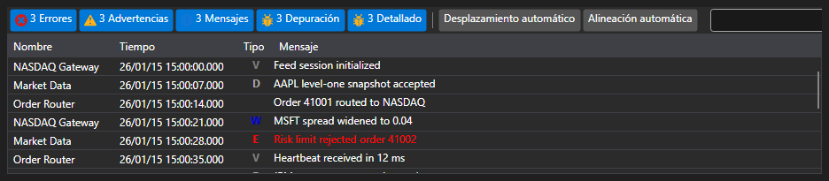

# Monitorización visual

Para simplificar la monitorización, puede usar el componente especial [Monitor](xref:StockSharp.Xaml.Monitor). Véase también [Componentes visuales de logging](../graphical_user_interface/logging.md).



Esta ventana permite mostrar mensajes de todos los [ILogSource](xref:Ecng.Logging.ILogSource): 

- estrategias ([Strategy](xref:StockSharp.Algo.Strategies.Strategy));
- conectores ([IConnector](xref:StockSharp.BusinessEntities.IConnector));
- implementaciones propias de [ILogSource](xref:Ecng.Logging.ILogSource) (por ejemplo, la ventana principal del algoritmo).

El anidamiento de fuentes se muestra en forma de árbol. Cada nodo padre contiene mensajes de todas las fuentes anidadas, y así sucesivamente hasta el nivel más bajo. Para los conectores esto también es útil al usar [BasketTrader](../connectors.md). De forma similar, el mismo anidamiento se puede organizar para su propio algoritmo implementando la propiedad [ILogSource.Parent](xref:Ecng.Logging.ILogSource.Parent).

## Uso de Monitor

1. Primero, necesita crear una ventana y agregar el componente.
2. Después, la ventana creada debe agregarse a su [LogManager](xref:Ecng.Logging.LogManager) mediante [GuiLogListener](xref:StockSharp.Xaml.GuiLogListener):

   ```cs
   _logManager.Listeners.Add(new GuiLogListener(monitor));
   ```
3. A partir de entonces, todas las fuentes [LogManager.Sources](xref:Ecng.Logging.LogManager.Sources) (estrategias, conectores, etc.) enviarán mensajes a [Monitor](xref:StockSharp.Xaml.Monitor).

## Contenido recomendado

[Componentes visuales de logging](../graphical_user_interface/logging.md)
