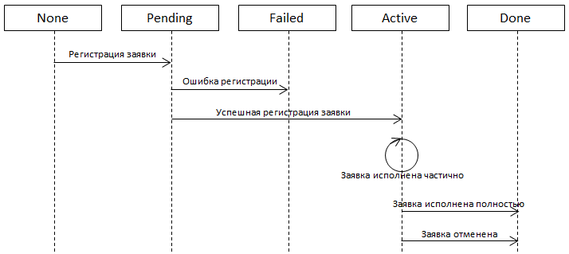

# Estados de órdenes

StockSharp API proporciona la posibilidad de recibir información sobre órdenes mediante el mecanismo de suscripciones integrado. Al igual que con los datos de mercado, la información transaccional usa un enfoque unificado basado en [Subscription](xref:StockSharp.BusinessEntities.Subscription).

## Eventos relacionados con órdenes

[Connector](xref:StockSharp.Algo.Connector) proporciona los siguientes eventos para procesar información de órdenes:

| Evento | Descripción |
|---------|----------|
| [OrderReceived](xref:StockSharp.Algo.Connector.OrderReceived) | Evento para recibir información de órdenes |
| [OrderRegisterFailReceived](xref:StockSharp.Algo.Connector.OrderRegisterFailReceived) | Evento de fallo de registro de orden |
| [OrderCancelFailReceived](xref:StockSharp.Algo.Connector.OrderCancelFailReceived) | Evento de fallo de cancelación de orden |
| [OrderEditFailReceived](xref:StockSharp.Algo.Connector.OrderEditFailReceived) | Evento de fallo de modificación de orden |
| [OwnTradeReceived](xref:StockSharp.Algo.Connector.OwnTradeReceived) | Evento para recibir información sobre trades propios |

## Enum OrderStates

Durante su vida, una orden pasa por los siguientes estados:



- [OrderStates.None](xref:StockSharp.Messages.OrderStates.None) - la orden se ha creado en el algoritmo de trading pero aún no se ha enviado para registro.
- [OrderStates.Pending](xref:StockSharp.Messages.OrderStates.Pending) - la orden se ha enviado para registro ([RegisterOrder](xref:StockSharp.BusinessEntities.ITransactionProvider.RegisterOrder(StockSharp.BusinessEntities.Order)). El sistema está esperando confirmación de su aceptación por parte del exchange. Si la aceptación es correcta, se desencadenará el evento [OrderReceived](xref:StockSharp.BusinessEntities.ISubscriptionProvider.OrderReceived) y la orden pasará al estado [OrderStates.Active](xref:StockSharp.Messages.OrderStates.Active). También se inicializarán las propiedades [Order.Id](xref:StockSharp.BusinessEntities.Order.Id) y [Order.ServerTime](xref:StockSharp.BusinessEntities.Order.ServerTime). Si la orden se rechaza, se desencadenará el evento [OrderRegisterFailReceived](xref:StockSharp.BusinessEntities.ISubscriptionProvider.OrderRegisterFailReceived) con una descripción del error, y la orden pasará al estado [OrderStates.Failed](xref:StockSharp.Messages.OrderStates.Failed).
- [OrderStates.Active](xref:StockSharp.Messages.OrderStates.Active) - la orden está activa en el exchange. Dicha orden permanecerá activa hasta que se ejecute todo su volumen [Order.Volume](xref:StockSharp.BusinessEntities.Order.Volume) o se cancele forzosamente mediante [CancelOrder](xref:StockSharp.BusinessEntities.ITransactionProvider.CancelOrder(StockSharp.BusinessEntities.Order)). Si la orden se ejecuta parcialmente, se desencadenan los eventos [OwnTradeReceived](xref:StockSharp.BusinessEntities.ISubscriptionProvider.OwnTradeReceived) sobre nuevos trades de la orden colocada, así como el evento [OrderReceived](xref:StockSharp.BusinessEntities.ISubscriptionProvider.OrderReceived), que pasa una notificación sobre el cambio del saldo de la orden [Order.Balance](xref:StockSharp.BusinessEntities.Order.Balance). Este último evento también se desencadenará en caso de cancelación de la orden.
- [OrderStates.Done](xref:StockSharp.Messages.OrderStates.Done) - la orden ya no está activa en el exchange (se ejecutó completamente o se canceló).
- [OrderStates.Failed](xref:StockSharp.Messages.OrderStates.Failed) - la orden no fue aceptada por el exchange (o por un sistema intermedio, como la parte servidor de la plataforma de trading) por alguna razón.

## Suscripciones automáticas

De forma predeterminada, [Connector](xref:StockSharp.Algo.Connector) crea automáticamente suscripciones para información transaccional al conectarse ([SubscriptionsOnConnect](xref:StockSharp.Algo.Connector.SubscriptionsOnConnect)). Esto incluye suscripciones a:

- Información de órdenes
- Información de trades
- Información de posiciones
- Búsqueda básica de instrumentos

Ejemplo de manejo de un evento de recepción de orden:

```cs
private void InitConnector()
{
	// Suscribirse al evento de recepción de órdenes
	Connector.OrderReceived += OnOrderReceived;
	
	// Suscribirse al evento de recepción de trades propios
	Connector.OwnTradeReceived += OnOwnTradeReceived;
	
	// Suscribirse al evento de fallo de registro de orden
	Connector.OrderRegisterFailReceived += OnOrderRegisterFailed;
}

private void OnOrderReceived(Subscription subscription, Order order)
{
	// Procesar la orden recibida
	_ordersWindow.OrderGrid.Orders.TryAdd(order);
	
	// ¡Importante! Comprobar si la orden pertenece a la suscripción actual
	// para evitar procesamiento duplicado
	if (subscription == _myOrdersSubscription)
	{
		// Procesamiento adicional para la suscripción específica
		Console.WriteLine($"Order: {order.TransactionId}, State: {order.State}");
	}
}
```

## Creación manual de suscripciones de órdenes

En algunos casos, puede necesitar solicitar explícitamente información sobre órdenes. Para ello, puede crear suscripciones separadas:

```cs
// Crear una suscripción para órdenes de una cartera específica
var ordersSubscription = new Subscription(DataType.Transactions, portfolio)
{
	TransactionId = Connector.TransactionIdGenerator.GetNextId(),
};

// Manejador para recibir órdenes
Connector.OrderReceived += (subscription, order) =>
{
	if (subscription == ordersSubscription)
	{
		Console.WriteLine($"Order: {order.TransactionId}, State: {order.State}, Portfolio: {order.Portfolio.Name}");
	}
};

// Iniciar la suscripción
Connector.Subscribe(ordersSubscription);
```

## Comprobación del estado de una orden

Los métodos de extensión se usan para determinar el estado actual de una orden:

```cs
// Comprobar estado de la orden
Order order = ...; // orden recibida

// ¿Está cancelada la orden?
bool isCanceled = order.IsCanceled();

// ¿Está completamente ejecutada la orden?
bool isMatched = order.IsMatched();

// ¿Está parcialmente ejecutada la orden?
bool isPartiallyMatched = order.IsMatchedPartially();

// ¿Está ejecutada al menos una parte de la orden?
bool isNotEmpty = order.IsMatchedEmpty();

// Obtener el volumen ejecutado
decimal matchedVolume = order.GetMatchedVolume();
```

## Enfoque avanzado: trabajo con múltiples suscripciones

En escenarios complejos, puede necesitar trabajar simultáneamente con varias suscripciones de órdenes. En este caso, es importante manejar correctamente los eventos para evitar duplicaciones:

```cs
private Subscription _portfolio1OrdersSubscription;
private Subscription _portfolio2OrdersSubscription;

private void RequestOrdersForDifferentPortfolios()
{
	// Suscripción para órdenes de la primera cartera
	_portfolio1OrdersSubscription = new Subscription(DataType.Transactions, _portfolio1);
	
	// Suscripción para órdenes de la segunda cartera
	_portfolio2OrdersSubscription = new Subscription(DataType.Transactions, _portfolio2);
	
	// Manejador común para recibir órdenes
	Connector.OrderReceived += OnMultipleSubscriptionOrderReceived;
	
	// Iniciar suscripciones
	Connector.Subscribe(_portfolio1OrdersSubscription);
	Connector.Subscribe(_portfolio2OrdersSubscription);
}

private void OnMultipleSubscriptionOrderReceived(Subscription subscription, Order order)
{
	// Determinar a qué suscripción pertenece la orden
	if (subscription == _portfolio1OrdersSubscription)
	{
		// Procesar órdenes de la primera cartera
	}
	else if (subscription == _portfolio2OrdersSubscription)
	{
		// Procesar órdenes de la segunda cartera
	}
}
```

> [!NOTE]
> Este enfoque avanzado con múltiples suscripciones a órdenes debe usarse solo en casos excepcionales cuando el mecanismo estándar de suscripción sea insuficiente.

## Naturaleza asíncrona de las transacciones

El envío de transacciones (registro, reemplazo o cancelación de órdenes) se realiza de forma asíncrona. Esto permite que el programa de trading no espere la confirmación del exchange, sino que continúe trabajando, lo que acelera la reacción ante cambios en la situación de mercado.

Para realizar seguimiento del estado de una orden, debe suscribirse a los eventos correspondientes:
- [OrderReceived](xref:StockSharp.Algo.Connector.OrderReceived) para recibir actualizaciones de estado de orden
- [OrderRegisterFailReceived](xref:StockSharp.Algo.Connector.OrderRegisterFailReceived) para manejar errores de registro

## Véase también

- [Suscripciones](../market_data/subscriptions.md)
- [Estados de órdenes](orders_states.md)
- [Creación de una nueva orden](create_new_order.md)
- [Cancelación de órdenes](order_cancel.md)
