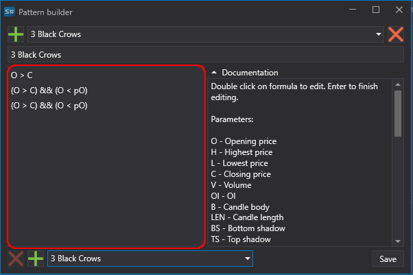

# Patrones

**Pattern** (del inglés: patrón, modelo, muestra) — en análisis técnico, se refiere a combinaciones estables y recurrentes de datos de precio, volumen o indicadores. El análisis de patrones se basa en uno de los axiomas del análisis técnico: "la historia se repite"; se considera que combinaciones recurrentes de datos llevan a resultados similares.

Los patrones también se llaman "**plantillas**" o "**figuras**" de análisis técnico.

Los patrones se dividen convencionalmente en:

- Indeterminados (pueden llevar tanto a la continuación como al cambio de la tendencia actual).
- Patrones de continuación de la tendencia actual.
- Patrones de reversión de la tendencia existente.

## Uso de patrones

### En Designer

[Designer](../designer.md) tiene patrones de velas predefinidos integrados que se pueden usar en su estrategia de negociación. Los patrones se llaman mediante el cubo [Indicador](../designer/strategies/using_visual_designer/elements/common/indicator.md), con la selección posterior del valor correspondiente. El propio patrón se selecciona de la lista desplegable en la ventana de la derecha.


También es posible editar patrones existentes y agregar sus propios patrones personalizados. Para hacerlo, debe hacer clic en el botón , después de lo cual se mostrará la ventana de edición de patrones.



Para crear su propio patrón, haga clic en el botón  en la parte superior de la ventana. Al hacer clic en el botón , se elimina el patrón.

### En Terminal

En [Terminal](../terminal.md), los patrones se agregan al gráfico como cualquier otro indicador. Para hacerlo, simplemente haga clic con el botón derecho en el gráfico y seleccione el indicador correspondiente de la lista de disponibles.

### En StockSharp API

Al usar [S#](../api.md) (o al crear [estrategias desde código](../designer/strategies/using_code.md) en Designer), el trabajo con patrones se realiza como con cualquier otro indicador. Ejemplo de uso:

```cs
// Creación de un indicador de patrón
var patternIndicator = new CandlePatternIndicator
{
	// Establecer el patrón deseado
	Pattern = new ExpressionCandlePattern("Mi patrón", new[]
	{
		new CandleExpressionCondition(Paths.FileSystem, "C > O"), // La vela actual es alcista
		new CandleExpressionCondition(Paths.FileSystem, "pC < pO") // La vela anterior es bajista
	})
};

// Agregar el indicador a la colección
Indicators.Add(patternIndicator);

// Procesar una vela
var result = patternIndicator.Process(candle);

// Comprobar el resultado
if (result.GetValue<bool>())
{
	// Patrón detectado, realizar las acciones necesarias
}
```

## Formato de descripción de patrones

Al editar un patrón, cada línea representa una vela separada. La línea superior es la vela actual; en consecuencia, la segunda línea es una vela atrás, la tercera y las siguientes son menos 2 y más velas.

El editor usa los siguientes parámetros:
- O - precio de apertura,
- H - máximo,
- L - mínimo,
- C - precio de cierre,
- V - volumen,
- OI - interés abierto,
- B - cuerpo de la vela,
- LEN - longitud de la vela (de máximo a mínimo),
- BS - sombra inferior de la vela,
- TS - sombra superior de la vela.

Con los parámetros, es posible usar los siguientes índices (referencias) a los valores deseados. Por ejemplo, para el precio de cierre:
- C: precio de cierre de la vela actual,
- C1: precio de cierre de la primera vela después de la actual,
- C2: precio de cierre de la segunda vela después de la actual,
- pC: precio de cierre de la vela anterior,
- pC1: precio de cierre de la vela antes de la anterior,
Todas las referencias deben estar dentro del rango del patrón actual. Por ejemplo, el rango del patrón 3 Black Crows consta de la vela actual y dos velas anteriores, por lo que no se permite hacer referencia a la tercera vela anterior.

Para verificación adicional de parámetros en correlación, se usa la expresión &&, que representa un AND lógico.

Al describir un patrón, también es posible usar las siguientes funciones: abs, acos, asin, atan, ceiling, cos, exp, floor, log, log10, max, min, pow, round, sign, sin, sqrt, tan, truncate. Se explica más sobre el uso de funciones en la descripción del cubo [Fórmula](../designer/strategies/using_visual_designer/elements/common/formula.md).

Al usar [ExpressionCandlePattern](xref:StockSharp.Algo.Candles.Patterns.ExpressionCandlePattern) en código, las fórmulas se crean con las mismas reglas descritas anteriormente y usan las mismas variables.

## Patrones estándar

Para crear rápidamente patrones basados en los existentes, puede usar la sección en la parte inferior de la ventana del editor de patrones. Al hacer clic en el botón  en la parte inferior de la ventana, se agrega a la ventana de edición la lógica del patrón seleccionado en la lista desplegable opuesta. El botón  en la parte inferior de la ventana elimina la línea seleccionada en la ventana de edición.

## Funciones avanzadas

- [ComplexCandlePattern](xref:StockSharp.Algo.Candles.Patterns.ComplexCandlePattern) — permite combinar varios patrones en un único patrón compuesto para análisis más complejo.
- [ICandlePatternProvider](xref:StockSharp.Algo.Candles.Patterns.ICandlePatternProvider) — interfaz de proveedor de patrones que permite cargar y guardar patrones personalizados.
