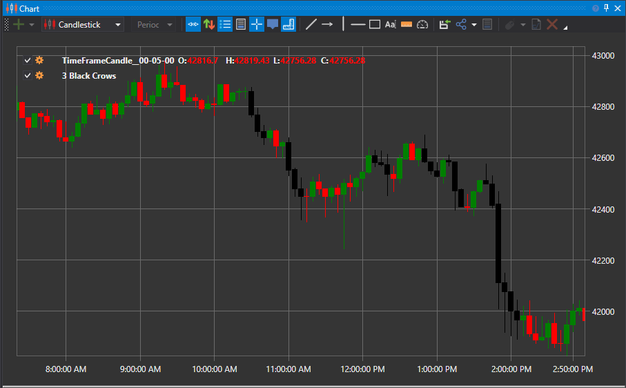

# Patrón 3 Black Crows y 3 White Soldiers

### 3 Black Crows

Three Black Crows es un patrón de velas bajista que puede predecir una reversión de una tendencia ascendente.

El patrón 3 Black Crows consta de tres velas consecutivas que abrieron dentro del cuerpo de la vela anterior y cerraron por debajo de la vela anterior. Los traders suelen usar este indicador en combinación con otros indicadores técnicos o patrones gráficos como confirmación de una reversión.

##### Características clave:

- Three Black Crows es un patrón de velas bajista usado para pronosticar la reversión de la tendencia alcista actual.
- Los traders lo usan junto con otros indicadores técnicos, como el Relative Strength Index (RSI).
- El tamaño de las velas y sus sombras pueden indicar el riesgo de que la reversión pase a ser un retroceso.
- El patrón opuesto a Three Black Crows es Three White Soldiers, que indica una reversión de tendencia bajista.

### 3 White Soldiers

Three White Soldiers es un patrón de velas alcista usado para pronosticar la reversión de la tendencia bajista actual en el gráfico de precios. El patrón consta de tres velas largas consecutivas que abren dentro del cuerpo de la vela anterior y cierran superando el máximo de la vela anterior. Estas velas no deben tener sombras muy largas e idealmente abren dentro del cuerpo de la vela anterior del patrón.

##### Características clave

- Three White Soldiers se considera un modelo de reversión fiable si se confirma con otros indicadores técnicos, como el Relative Strength Index (RSI).
- El tamaño de las velas y la longitud de las sombras se usan para evaluar si existe riesgo de retroceso.
- El patrón opuesto a Three White Soldiers es Three Black Crows, que indica una reversión de tendencia alcista.

