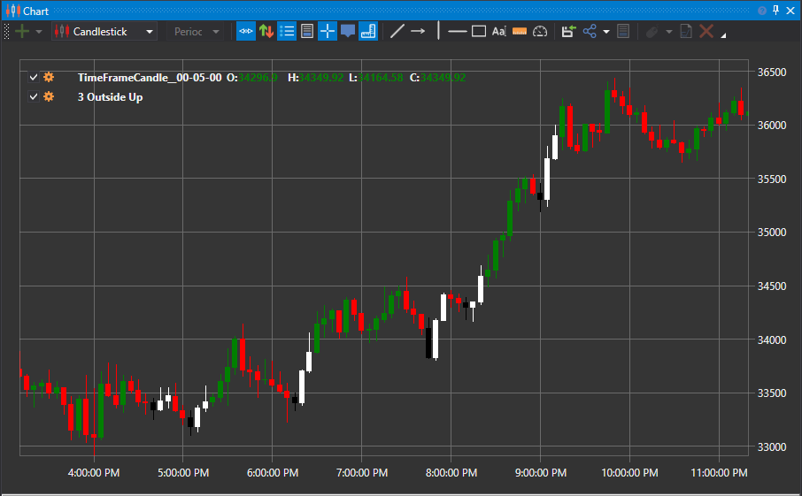

# Patrón 3 Outside Down y 3 Outside Up

Los términos 3 Outside Down y 3 Outside Up se refieren a patrones de reversión de tres velas. Para que se forme un patrón, tres velas deben formarse en una secuencia específica, indicando que la tendencia actual ha perdido impulso y puede señalar una reversión de la tendencia existente. En concreto, un patrón se forma cuando una vela bajista (que cierra por debajo de su apertura) es seguida por dos instancias de una vela alcista (que cierra por encima de su apertura), o viceversa.

##### Características clave:

- Los patrones 3 Outside Down/Up son patrones de tres velas que suelen señalar una reversión de tendencia.
- Los patrones 3 Outside Down y 3 Outside Up se caracterizan por una vela seguida inmediatamente por dos velas del color opuesto.
- Cada uno busca usar la psicología del mercado para comprender cambios de ánimo a corto plazo.

### 3 Outside Up

Este patrón de velas alcista tiene las siguientes características:

1. El mercado está en una tendencia bajista.
2. La primera vela es bajista.
3. La segunda vela es alcista con un cuerpo largo y envuelve completamente a la primera vela.
4. La tercera vela es alcista con un cierre más alto que el de la segunda vela.

### 3 Outside Down

Esta variación del patrón es un modelo de velas bajista con las siguientes características:

1. El mercado está en una tendencia alcista.
2. La primera vela es alcista.
3. La segunda vela es bajista con un cuerpo largo que envuelve completamente a la primera vela.
4. La tercera vela es bajista con un cierre más bajo que el de la segunda vela.

La primera vela significa el comienzo del fin de la tendencia predominante, ya que la segunda vela envuelve a la primera. La tercera vela significa entonces una aceleración de la reversión.

## Véase también

[Patrón 3 Inside Down y 3 Inside Up](3_inside_down_3_side_up.md)
