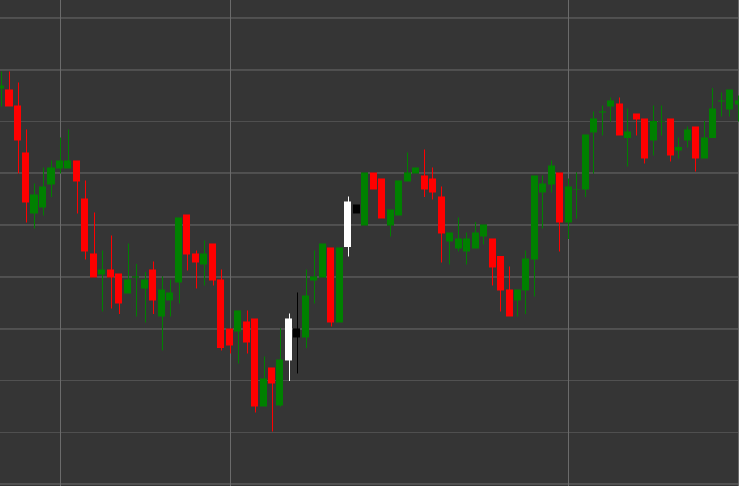

# Patrón Harami bajista

Harami bajista es un patrón de velas de reversión compuesto por dos velas que se forma en una tendencia alcista. El término "harami" proviene de la palabra japonesa que significa "embarazo", ya que la vela pequeña (hijo) está contenida dentro de la vela grande (madre).

##### Características clave:

- La primera vela es blanca (alcista) con precio de apertura menor que el de cierre (O < C) y un cuerpo largo.
- La segunda vela es negra (bajista) con precio de apertura mayor que el de cierre (O > C) y un cuerpo más pequeño.
- El cuerpo de la segunda vela está completamente contenido dentro del cuerpo de la primera vela (O < pC) y (C > pO).
- Se forma en una tendencia alcista.

### Interpretación

Harami bajista señala un posible final de una tendencia alcista:

- La primera vela confirma la tendencia alcista existente y la fuerza de los compradores.
- La segunda vela, completamente contenida dentro de la primera, indica una pérdida de impulso alcista y posible aparición de vendedores.
- Cuanto menor sea el cuerpo de la segunda vela en comparación con la primera, más pronunciada será la incertidumbre y el potencial de reversión.
- Si la segunda vela es un doji (con un cuerpo muy pequeño), el patrón se llama "Cruz harami" y se considera una señal más fuerte de incertidumbre.
- Este patrón suele considerarse una señal más débil en comparación con Envolvente bajista, pero puede ser un indicador más temprano de una posible reversión.

### Estrategias de trading

Harami bajista normalmente requiere confirmación adicional para entrar en posición:

- Esperar una vela bajista de confirmación después de la formación del patrón antes de entrar en una posición corta.
- Colocar un stop-loss por encima del máximo del patrón o del máximo de la primera vela.
- Usar el volumen de trading como confirmación adicional: la disminución del volumen en la segunda vela y su aumento en las velas bajistas posteriores refuerza la señal.
- Combinar con otros indicadores técnicos, como RSI en zona de sobrecompra o divergencia de oscilador.
- Considerar el patrón en niveles de resistencia o zonas de sobrecompra para aumentar la probabilidad de una operación exitosa.
- Posible uso para cerrar posiciones largas existentes, incluso si la señal no es lo suficientemente fuerte para abrir posiciones cortas.

## Véase también

[Patrón Harami alcista](bullish_harami.md)

[Patrón Envolvente bajista](bearish_engulfing.md)
