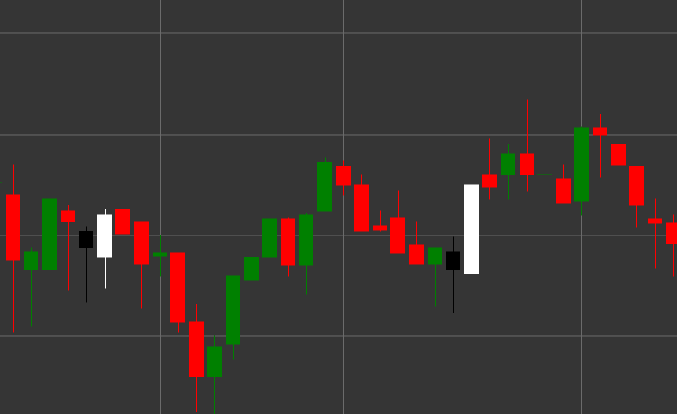

# Patrón Bullish Engulfing

Bullish Engulfing es un potente patrón de velas de reversión alcista compuesto por dos velas que se forma en una tendencia bajista. La primera vela es negra (bajista), seguida de una vela blanca (alcista), cuyo cuerpo envuelve (cubre) completamente el cuerpo de la vela anterior.

##### Características clave:

- La primera vela es negra con precio de apertura mayor que el de cierre (O > C).
- La segunda vela es blanca con precio de apertura menor que el de cierre (O < C).
- El precio de apertura de la segunda vela es menor que el precio de cierre de la primera vela (O < pC).
- El precio de cierre de la segunda vela es mayor que el precio de apertura de la primera vela (C > pO).
- El cuerpo de la segunda vela envuelve completamente el cuerpo de la primera vela.
- Se forma en una tendencia bajista.

### Interpretación

Bullish Engulfing se considera una de las señales más fiables de reversión de una tendencia bajista:

- La primera vela confirma la tendencia bajista existente y muestra el control de los vendedores.
- La segunda vela demuestra una transición brusca del control hacia los compradores, que no solo revierten las pérdidas del período anterior sino que también crean una ganancia significativa.
- El envolvimiento completo del cuerpo de la vela anterior simboliza un cambio completo del sentimiento predominante, de bajista a alcista.
- Cuanto mayor sea el tamaño de la segunda vela en comparación con la primera, más fuerte será la señal.
- Si el patrón se forma en un nivel de soporte o después de una tendencia bajista prolongada, su importancia aumenta.

### Estrategias de trading

Bullish Engulfing proporciona excelentes oportunidades para entrar en una posición larga:

- Entrar en una posición larga después de la formación del patrón, normalmente en la apertura de la siguiente vela.
- Colocar un stop-loss por debajo del mínimo de la segunda vela del patrón.
- El objetivo de beneficio puede establecerse en función de niveles de resistencia previos, relación riesgo/beneficio o usando indicadores técnicos.
- Un volumen de trading alto durante la formación de la segunda vela aumenta significativamente la fiabilidad de la señal.
- Combinar con otros indicadores, como RSI en zona de sobreventa o convergencia de medias móviles, para aumentar la probabilidad de una operación exitosa.

## Véase también

[Patrón Bearish Engulfing](bearish_engulfing.md)

[Patrón Piercing](piercing.md)
