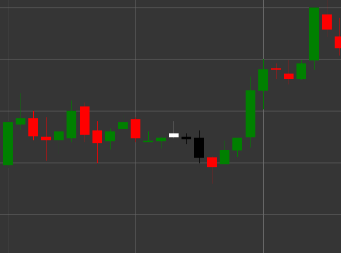

# Patrón Estrella vespertina

Estrella vespertina es un patrón de velas de reversión bajista compuesto por tres velas que se forma en una tendencia alcista. Este patrón muestra una transición de sentimiento alcista a bajista mediante un período de incertidumbre o consolidación.

##### Características clave:

- La primera vela es blanca (alcista) con precio de apertura menor que el de cierre (O < C).
- La segunda vela tiene un cuerpo pequeño (puede ser alcista o bajista) y forma un gap alcista desde la primera vela. El cuerpo es significativamente menor que el cuerpo de la primera vela (B < pB * 0.5m).
- La tercera vela es negra (bajista) con precio de apertura mayor que el de cierre y un cuerpo grande ((O > C) && (B > pB * 2)), que cierra profundamente dentro del cuerpo de la primera vela.
- Se forma en una tendencia alcista.

### Interpretación

Estrella vespertina se considera una señal fuerte de una posible reversión de una tendencia alcista:

- La primera vela confirma la fuerza de la tendencia alcista.
- La segunda vela (estrella) muestra debilitamiento de la presión alcista e incertidumbre en el mercado.
- La tercera vela demuestra el regreso de los vendedores y un cambio de control de alcistas a bajistas.
- Cuanto más profundamente penetre la tercera vela en el cuerpo de la primera, más fuerte será la señal de reversión.
- Si la segunda vela es un doji (con un cuerpo muy pequeño), el patrón se llama "Estrella doji vespertina" y se considera una señal aún más fuerte.

### Estrategias de trading

Estrella vespertina proporciona buenas oportunidades para entrar en una posición corta:

- Entrar en una posición corta después de la formación del patrón, normalmente en la apertura de la cuarta vela o cuando se rompe el mínimo de la tercera vela.
- Colocar un stop-loss por encima del máximo de la segunda vela o del máximo de todo el patrón.
- El objetivo de beneficio puede establecerse en función de niveles de Fibonacci relativos al movimiento alcista previo o niveles de soporte anteriores.
- Prestar atención al volumen: el aumento del volumen en la tercera vela confirma la fuerza de la reversión bajista.
- Combinar con otros indicadores técnicos, como RSI en zona de sobrecompra o líneas de resistencia, para aumentar la fiabilidad de la señal.
- También se puede usar como señal para salir de posiciones largas existentes.

## Véase también

[Patrón Estrella matinal](morning_star.md)

[Patrón Tres cuervos negros](three_black_crows.md)
