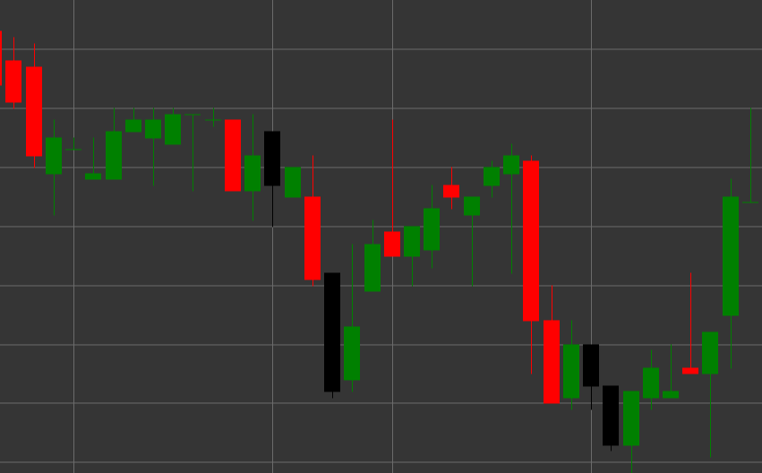

# Patrón Hanging Man

Hanging Man es un patrón de velas de reversión bajista que se forma en una tendencia alcista. La vela tiene un cuerpo pequeño en la parte superior y una larga sombra inferior, con la sombra superior ausente o muy corta. La forma de la vela se parece a la figura de una persona con piernas colgantes, de ahí el nombre.

##### Características clave:

- El precio de apertura es mayor que el precio de cierre (O > C), aunque puede ser lo contrario.
- Cuerpo pequeño de la vela en la parte superior del rango de precios.
- Larga sombra inferior, normalmente 2-3 veces más larga que el cuerpo.
- Sin sombra superior o con una muy corta (TS == 0).
- Se forma en una tendencia alcista.

### Interpretación

Hanging Man se considera una advertencia de un posible final de una tendencia alcista:

- La larga sombra inferior muestra que el precio cayó significativamente durante la sesión de trading, indicando la aparición de vendedores.
- A pesar de que los compradores pudieron empujar el precio de vuelta a la parte superior del rango, el hecho mismo de una caída significativa del precio en una tendencia alcista es una señal de advertencia.
- El color del cuerpo de la vela es menos importante, aunque un cuerpo negro/rojo se considera más bajista que uno blanco/verde.
- Cuanto más larga sea la sombra inferior y menor el cuerpo de la vela, más fuerte será la señal.
- Este patrón requiere confirmación de velas posteriores.

### Estrategias de trading

Hanging Man normalmente requiere confirmación adicional antes de tomar decisiones de trading:

- Esperar una vela bajista de confirmación después de la formación de Hanging Man antes de entrar en una posición corta.
- Colocar un stop-loss por encima del máximo de Hanging Man.
- Considerar el volumen de trading: un volumen alto durante la formación del patrón y en la vela de confirmación refuerza la señal bajista.
- Combinar con otros indicadores técnicos, como RSI en zona de sobrecompra o divergencia en osciladores.
- Posible uso para cierre parcial de posiciones largas existentes incluso sin abrir una posición corta.
- Prestar especial atención al patrón si se forma en niveles de resistencia importantes o después de un movimiento alcista prolongado.

## Véase también

[Patrón Hammer](hammer.md)

[Patrón Shooting Star](shooting_star.md)
