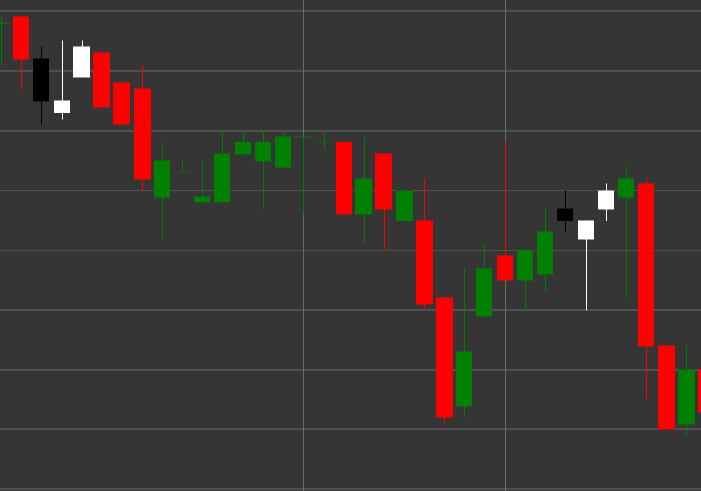

# Patrón Morning Star

Morning Star es un patrón de velas de reversión alcista compuesto por tres velas que se forma en una tendencia bajista. Este patrón muestra una transición de sentimiento bajista a alcista mediante un período de incertidumbre o consolidación.

##### Características clave:

- La primera vela es negra (bajista) con precio de apertura mayor que el de cierre (O > C).
- La segunda vela tiene un cuerpo pequeño (puede ser alcista o bajista) y forma un gap bajista desde la primera vela. El cuerpo es significativamente menor que el cuerpo de la primera vela (B < pB * 0.5m).
- La tercera vela es blanca (alcista) con precio de apertura menor que el de cierre (O < C), que cierra profundamente dentro del cuerpo de la primera vela.
- Se forma en una tendencia bajista.

### Interpretación

Morning Star se considera una señal fuerte de una posible reversión de una tendencia bajista:

- La primera vela confirma la fuerza de la tendencia bajista.
- La segunda vela (estrella) muestra debilitamiento de la presión bajista e incertidumbre en el mercado.
- La tercera vela demuestra el regreso de los compradores y un cambio de control de bajistas a alcistas.
- Cuanto más profundamente penetre la tercera vela en el cuerpo de la primera, más fuerte será la señal de reversión.
- Si la segunda vela es un doji (con un cuerpo muy pequeño), el patrón se llama "Morning Doji Star" y se considera una señal aún más fuerte.

### Estrategias de trading

Morning Star proporciona buenas oportunidades para entrar en una posición larga:

- Entrar en una posición larga después de la formación del patrón, normalmente en la apertura de la cuarta vela o cuando se rompe el máximo de la tercera vela.
- Colocar un stop-loss por debajo del mínimo de la segunda vela o del mínimo de todo el patrón.
- El objetivo de beneficio puede establecerse en función de niveles de Fibonacci relativos al movimiento bajista previo o niveles de resistencia anteriores.
- Prestar atención al volumen: el aumento del volumen en la tercera vela confirma la fuerza de la reversión alcista.
- Combinar con otros indicadores técnicos, como RSI en zona de sobreventa o líneas de soporte, para aumentar la fiabilidad de la señal.

## Véase también

[Patrón Evening Star](evening_star.md)

[Patrón Three White Soldiers](three_white_soldiers.md)
