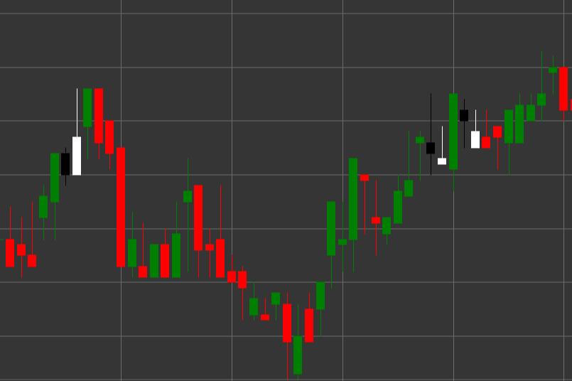

# Patrón Tweezer Bottom

Tweezer Bottom es un patrón de velas de reversión alcista compuesto por dos velas que se forma en una tendencia bajista. Una característica del patrón es que ambas velas tienen el mismo mínimo o casi el mismo, pareciéndose a unas pinzas con dos extremos idénticos.

##### Características clave:

- La primera vela es negra (bajista) con precio de apertura mayor que el de cierre (O > C).
- La segunda vela es blanca (alcista) con precio de apertura menor que el de cierre (O < C).
- La segunda vela no tiene sombra inferior o tiene una muy corta (BS == 0).
- La sombra superior de la segunda vela es mayor que su cuerpo (TS > B).
- Ambas velas tienen mínimos iguales o muy cercanos.
- Se forma en una tendencia bajista.

### Interpretación

Tweezer Bottom se considera una señal de una posible reversión de una tendencia bajista:

- La primera vela confirma la tendencia bajista existente.
- La segunda vela con el mismo mínimo muestra que los bajistas intentaron dos veces romper el mismo nivel pero fallaron.
- Esta incapacidad de superar cierto nivel indica debilitamiento del impulso bajista y posible inicio de movimiento alcista.
- La ausencia de sombra inferior en la segunda vela con una larga sombra superior indica fuerte presión alcista desde el nivel mínimo.
- El patrón es particularmente significativo si se forma en un nivel de soporte importante o después de un movimiento bajista prolongado.

### Estrategias de trading

Tweezer Bottom requiere un enfoque prudente y a menudo confirmación adicional:

- Esperar una vela alcista de confirmación después de la formación del patrón antes de entrar en una posición larga.
- Colocar un stop-loss ligeramente por debajo del mínimo común del patrón.
- Considerar el volumen de trading: la disminución del volumen en la primera vela y el aumento en la segunda y en velas alcistas posteriores refuerza la señal.
- Combinar con otros indicadores técnicos, como RSI en zona de sobreventa o divergencia alcista en osciladores.
- Posible uso para cierre parcial o completo de posiciones cortas existentes.
- Prestar especial atención a los movimientos de precio posteriores: un rápido crecimiento del precio después del patrón confirma su importancia.

## Véase también

[Patrón Tweezer Top](tweezer_top.md)

[Patrón Morning Star](morning_star.md)
