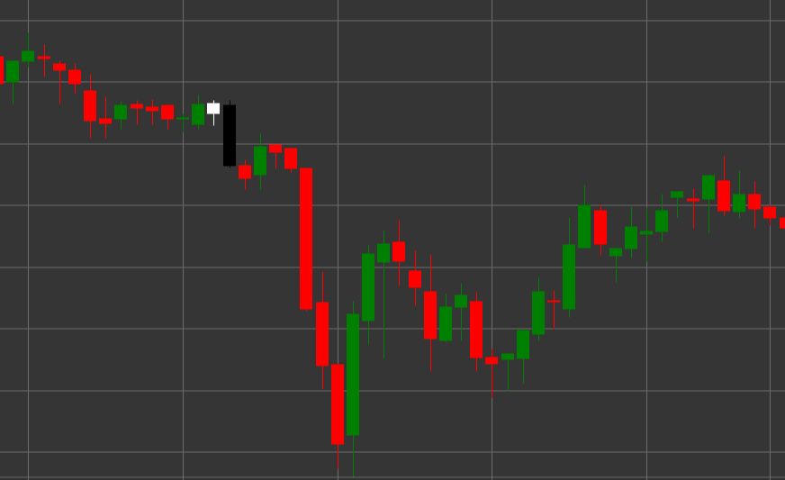

# Patrón Tweezer Top

Tweezer Top es un patrón de velas de reversión bajista compuesto por dos velas que se forma en una tendencia alcista. Una característica del patrón es que ambas velas tienen el mismo máximo o casi el mismo, pareciéndose a unas pinzas con dos extremos idénticos.

##### Características clave:

- La primera vela es blanca (alcista) con precio de apertura menor que el de cierre (O < C).
- La segunda vela es negra (bajista) con precio de apertura mayor que el de cierre (O > C).
- Ambas velas tienen máximos iguales o muy cercanos (H == pH).
- El cuerpo de la segunda vela es significativamente mayor que el cuerpo de la primera vela (B > (pB * 3)).
- Se forma en una tendencia alcista.

### Interpretación

Tweezer Top se considera una señal de una posible reversión de una tendencia alcista:

- La primera vela confirma la tendencia alcista existente.
- La segunda vela con el mismo máximo muestra que los alcistas intentaron dos veces romper el mismo nivel pero fallaron.
- Esta incapacidad de superar cierto nivel indica debilitamiento del impulso alcista y posible inicio de movimiento bajista.
- El cuerpo más significativo de la segunda vela en comparación con la primera refuerza la señal bajista.
- El patrón es particularmente significativo si se forma en un nivel de resistencia importante o después de un movimiento alcista prolongado.

### Estrategias de trading

Tweezer Top requiere un enfoque prudente y a menudo confirmación adicional:

- Esperar una vela bajista de confirmación después de la formación del patrón antes de entrar en una posición corta.
- Colocar un stop-loss ligeramente por encima del máximo común del patrón.
- Considerar el volumen de trading: la disminución del volumen en la primera vela y el aumento en la segunda y en velas bajistas posteriores refuerza la señal.
- Combinar con otros indicadores técnicos, como RSI en zona de sobrecompra o divergencia en osciladores.
- Posible uso para cierre parcial o completo de posiciones largas existentes.
- Prestar especial atención a los movimientos de precio posteriores: una rápida caída del precio después del patrón confirma su importancia.

## Véase también

[Patrón Tweezer Bottom](tweezer_bottom.md)

[Patrón Evening Star](evening_star.md)
