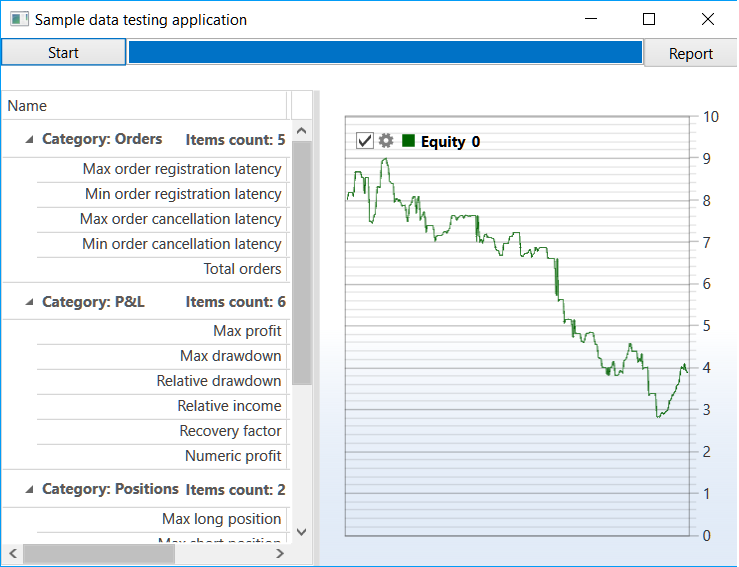

# Datos aleatorios

Las pruebas con datos aleatorios son un tipo especial de testing. No están pensadas para buscar parámetros óptimos. En cambio, permiten detectar errores en el código exponiendo el algoritmo de trading a distintos escenarios de exchange. 

Como regla general, durante el desarrollo del algoritmo solo se usa un determinado conjunto de escenarios. Por eso, cuando aparece una situación especial, el algoritmo puede reaccionar incorrectamente o lanzar excepciones. Por ejemplo, pueden darse las siguientes situaciones: 

- La estrategia trabaja con velas [TimeFrameCandleMessage](xref:StockSharp.Messages.TimeFrameCandleMessage) y espera en cada iteración que siempre exista una vela para el periodo solicitado. Comenzó un periodo en el que no hubo ninguna operación y la vela no se creó. Como resultado, si no existe un manejo adecuado, se lanzará [NullReferenceException](xref:System.NullReferenceException) y la estrategia se detendrá. 
- La estrategia trabaja con un instrumento poco líquido y usa [IOrderBookMessage](xref:StockSharp.Messages.IOrderBookMessage). La estrategia espera que el libro de órdenes siempre esté lleno. En algún momento, el libro de órdenes está lleno solo a medias (por ejemplo, hay bids, pero no offers). Si la estrategia no contempla esta situación, registrará una orden incorrectamente o lanzará una excepción y se detendrá. 
- La estrategia calcula niveles de precio. El código está escrito de forma que la estrategia espera a que se rompan niveles definidos de antemano. Si los niveles se calculan o se configuran incorrectamente, nunca serán atravesados o siempre se atravesará solo uno de ellos. Como resultado, la estrategia no realizará operaciones o esas operaciones perderán dinero. 

Para estos y muchos otros escenarios del funcionamiento del exchange que es imposible prever de antemano, [S#](../../api.md) proporciona pruebas con datos aleatorios, capaces de generar el máximo número de condiciones en un intervalo corto debido a su unicidad uniforme. 

## Pruebas con datos aleatorios de una estrategia de medias móviles

1. El ejemplo SampleRandomEmulation (*..Samples\/Testing\/SampleRandomEmulation*) es casi idéntico al ejemplo SampleHistoryTesting (su descripción se encuentra en la sección [pruebas con datos históricos](historical_data.md)) gracias al uso de la clase unificada [HistoryEmulationConnector](xref:StockSharp.Algo.Testing.HistoryEmulationConnector). Pero, a diferencia de las [pruebas con datos históricos](historical_data.md), en las pruebas con datos aleatorios los datos de mercado no se cargan, sino que se generan "sobre la marcha". Por lo tanto, en el ejemplo se agregan dos generadores de datos aleatorios: para el libro de órdenes y para las operaciones tick. En SampleHistoryTesting solo se usa un generador — para el libro de órdenes, ya que no hay historial almacenado. 

   ```cs
   _connector.MarketDataAdapter.SendInMessage(new GeneratorMessage
   {
       IsSubscribe = true,
       Generator = new RandomWalkTradeGenerator(new SecurityId { SecurityCode = security.Code })
       {
           Interval = TimeSpan.FromSeconds(1),
           MaxVolume = maxVolume,
           MaxPriceStepCount = 3,	
           GenerateOriginSide = true,
           MinVolume = minVolume,
           RandomArrayLength = 99,
       }
   });
   _connector.SubscribeMarketDepth(new TrendMarketDepthGenerator(_connector.GetSecurityId(security)) { GenerateDepthOnEachTrade = false });
   ```
2. El resultado del ejemplo es el siguiente: 
