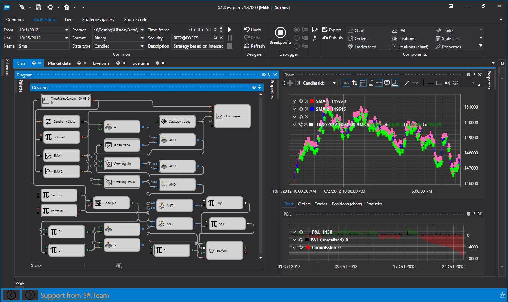

# Designer

**Designer** es una aplicación para crear estrategias de trading, hacer backtesting con datos históricos y gestionar estrategias en trading en vivo. Designer admite dos formas de crear estrategias:

1. [Diseñador visual](designer/strategies/using_visual_designer.md) no requiere habilidades de programación. Las estrategias se construyen combinando bloques y conectándolos con líneas, por lo que todo el flujo de trabajo se muestra visualmente.
2. [Estrategias basadas en código](designer/strategies/using_code.md) están pensadas para programadores experimentados. Las estrategias escritas en **C#**, **F#** o **Python** suelen ejecutarse más rápido que las estrategias visuales y no están limitadas por los bloques visuales disponibles. Puede escribir estrategias directamente en **Designer** o en un entorno de desarrollo C# como **Microsoft Visual Studio**, usando la biblioteca [API](api.md) para el desarrollo profesional de algoritmos de trading.

## Contenido recomendado

[Instalación de Designer](designer/installing_designer.md)
