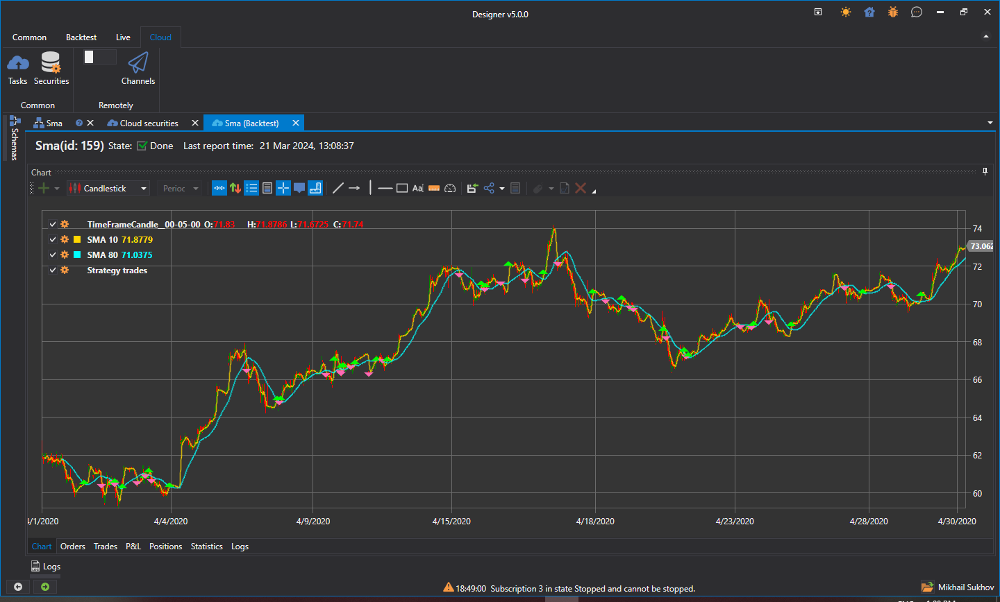

# Pruebas en la nube

Para probar estrategias en la nube, primero es necesario encontrar todos los instrumentos de interés. Para ello, en **Designer** debe abrir el panel de búsqueda de instrumentos disponibles para pruebas en la pestaña **Cloud**:

Al introducir el nombre del instrumento en el campo de búsqueda y hacer clic en **Search** (o pulsar **Enter**), el servidor de StockSharp devuelve los resultados de búsqueda adecuados. A la derecha de los nombres de los instrumentos también se indicarán los rangos de fechas de los datos históricos.

Este procedimiento debe realizarse solo una vez para cada instrumento nuevo. Después, los instrumentos encontrados se guardarán localmente en el disco y, al reiniciar **Designer**, ya se cargarán desde el almacenamiento local. Este paso es necesario porque se requiere especificar el instrumento al iniciar la estrategia (así como al especificar instrumentos directamente en el bloque [Variable](../strategies/using_visual_designer/elements/data_sources/variable.md)).

Después de esto, debe volver a la estrategia y habilitar la opción de nube en la pestaña **Backtest**:

Al iniciar la prueba, la estrategia se enviará a la nube de StockSharp en lugar de probarse localmente:

Una vez completada la prueba, el informe con los resultados se mostrará en la pestaña de tareas en espera:

Si desea ver el historial de pruebas en la nube, así como las tareas activas actuales, abra el panel **Tasks** en la pestaña **Cloud**:

