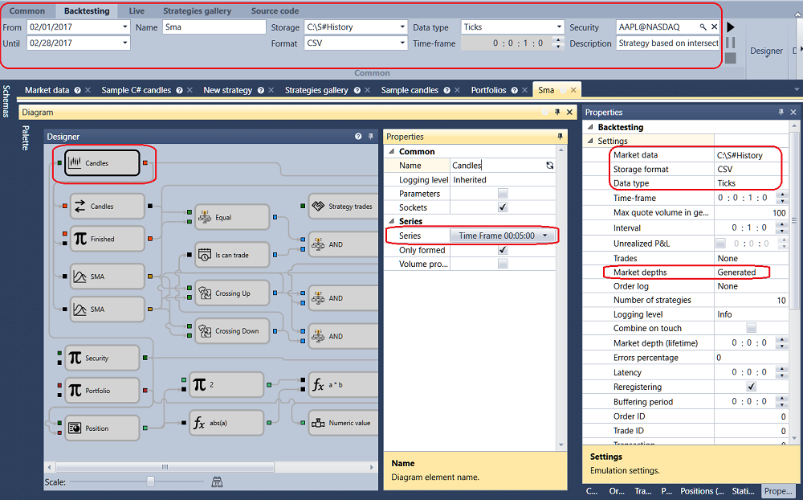
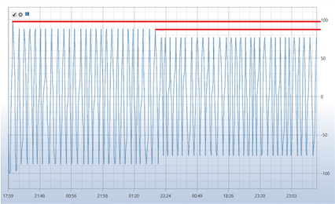

# Primeros pasos

Como ejemplo, se considerará la estrategia SMA.

Para ejecutar la prueba sobre historial, debe seleccionar una estrategia cuyo esquema se probará sobre datos históricos. La estrategia se selecciona en el panel [Esquemas](../user_interface/schemas.md), dentro de la carpeta de estrategias, haciendo doble clic en la estrategia de interés.

Antes de probar, cargue los datos de mercado (instrumentos, velas, operaciones tick y\/o libros de órdenes). Esto se describe en [Almacenamiento de datos de mercado](../market_data_storage.md).

Al cambiar a la pestaña con una estrategia, la pestaña **Emulación** se abre automáticamente en la **Cinta**. Defina el período de prueba en esta pestaña. En el campo de datos de mercado, especifique el almacenamiento requerido ([Almacenamiento de datos de mercado](../market_data_storage.md)); en el campo de instrumento, especifique el instrumento requerido.

En el ejemplo con la estrategia SMA se usarán los siguientes parámetros.

1. Instrumento AAPL@NASDAQ
2. Almacenamiento estándar \\Documents\\StockSharp\\Designer\\Storage
3. Formato de almacenamiento - CSV
4. Tipo de datos tomado del almacenamiento - Ticks
5. Libro de órdenes - generado
6. Profundidad del libro de órdenes - 5
7. Tamaño del spread - 2
8. Velas con marco temporal de 30 s
9. Volumen - 100

Es necesario configurar los parámetros seleccionados:

Después de configurar todos los parámetros requeridos, inicie la prueba de la estrategia haciendo clic en el botón .

Durante la prueba o después de ella, puede ver gráficos y tablas con la información de la prueba.

El gráfico muestra que las operaciones se realizan en la intersección de las medias móviles, tal como está previsto por la estrategia. También puede verse que las órdenes se ejecutan dentro de varias operaciones. Esto ocurre por el uso de un libro de órdenes generado, que aumenta el realismo de la prueba. El hecho de que las órdenes se ejecuten dentro de varias operaciones puede verse en la tabla de operaciones, en las estadísticas y en el gráfico de posiciones.

En el **gráfico de posiciones** puede verse que la estrategia ha reducido el volumen operado. Esto ocurrió porque el libro de órdenes generado tiene una profundidad de 5 y, como resultado, toda la profundidad del libro de órdenes no fue suficiente para ejecutar la orden de 200 lotes. Como la estrategia solo revierte la posición, cada vez que la profundidad del libro de órdenes no fue suficiente para ejecutar la orden, el tamaño de la orden se redujo.

El gráfico **P\/L** indica que la estrategia no es rentable con estos parámetros.

## Contenido recomendado

[Ejecución en vivo](../live_execution/getting_started.md)
