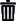
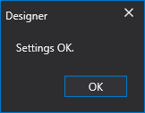

# Configuración de conexiones

1. Al hacer clic en la flecha junto al botón **Conectar** , aparece el botón **Configuración de conexión**:

2. Al hacer clic en el botón **Configuración de conexión**, se abre la ventana **Configuración de conexión**, que está dividida en 3 áreas:

3. Al hacer clic en el botón , se activa la lista desplegable de conectores compatibles. Los conectores seleccionados se muestran en el área n.º 1. El botón  elimina el conector seleccionado. La primera columna del área n.º 1 muestra si el conector se conectará al hacer clic en el botón Connect  o no se conectará . Estos valores se establecen con los botones  y .

Los campos **Datos de mercado** y **Operaciones** muestran si el conector admite datos de mercado y trabajo con órdenes.

4. Cuando se selecciona la casilla **Auto-connect**, la conexión se conecta automáticamente al iniciar [Designer](../designer.md).

5. El área n.º 2 muestra la configuración del conector seleccionado. Al hacer clic en , el programa redirige a la documentación ([API](../api.md)) sobre la configuración del conector seleccionado.

  > [!IMPORTANT]
  > **Advanced settings** se necesitan en casos especiales y no se recomienda modificarlos.

6. Al hacer clic en el botón **Comprobar**, se comprobará la conexión del conector actual. Si la comprobación falla, aparecerá una ventana con un error que describe la razón de la conexión fallida. Si la comprobación es correcta, aparecerá una ventana:

7. El área n.º 3 muestra los tipos de datos que el conector recibirá o transmitirá. Al hacer clic en la casilla \/ , puede habilitar\/deshabilitar la transmisión o recepción para este tipo de datos.

8. Al hacer clic en el botón **Network settings**, se abrirá la ventana **Proxy-server settings**:

## Contenido recomendado

[Panel de estrategias](live_execution/strategies_dashboard.md)
