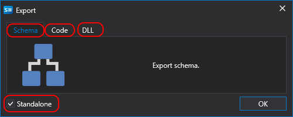

# Exportar

Designer permite exportar cualquier tipo de dato: estrategias, bloques e indicadores. Hay varias formas de exportar:

- En el panel **Esquemas**, haga clic con el botón derecho en la estrategia, bloque o indicador. En el menú que aparece, seleccione **Exportar**.
- En la pestaña **Común**, pulse el botón **Exportar**:

Después de pulsar **Exportar**, según el tipo de contenido, aparecerá una ventana:

- para un [esquema](../strategies/using_visual_designer.md):

  

  - esquema - exportar el esquema tal cual. El modo **Independiente** es necesario para esquemas que usan sus propios elementos o indicadores. En este caso, todos los elementos internos se exportarán dentro del diagrama de la estrategia.
  - código - convertir el esquema en código C#.
  - DLL - compilar el esquema en una DLL. Es adecuado si necesita mantener el código confidencial.

- para [código](../strategies/using_code.md):

  

  - esquema - exportar el código como archivo JSON, que incluirá tanto el propio código como las referencias necesarias para compilarlo.
  - código - exportar el código tal cual.
  - DLL - compilar el código en una DLL. Es adecuado si necesita mantener el código confidencial.

- para una [dll](../strategies/using_dll.md), aparecerá una ventana de selección de archivo.

## Véase también

[Ejecución de estrategias fuera de Designer](../live_execution/running_strategies_outside_of_designer.md)
