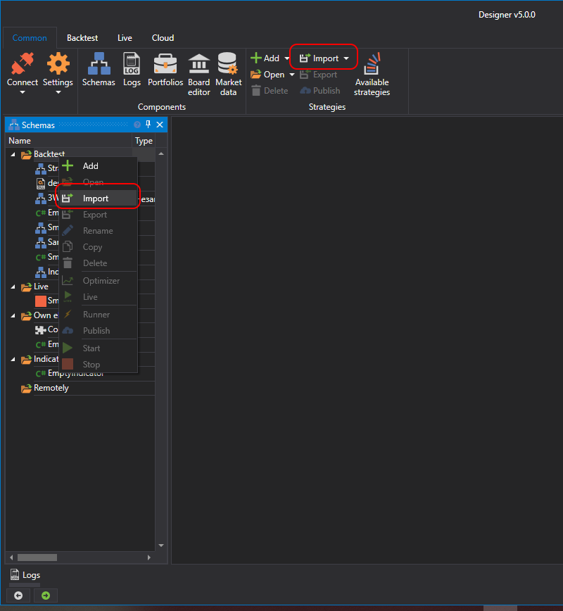

# Importar

Designer permite importar cualquier tipo de dato: estrategias, bloques e indicadores. Hay varias formas de importar:

- En el panel **Esquemas**, haga clic con el botón derecho en la carpeta de estrategias y, en el menú que aparece, seleccione **Importar**.
- En la pestaña **Común**, pulse el botón **Importar** y, en el menú que aparece, seleccione **Estrategia**, **Elemento propio** o **Indicador**:

Si ya existen datos con el mismo nombre, aparecerá una ventana que ofrece sobrescribirlos o añadirlos con otro nombre:

