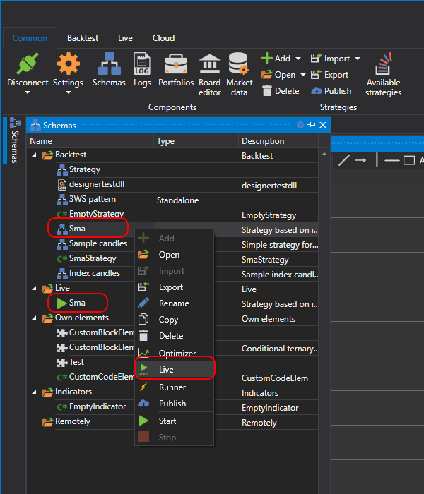

# Primeros pasos

Para añadir una estrategia a **Negociación en vivo**, en el panel [Esquemas](../user_interface/schemas.md) haga clic con el botón derecho en la estrategia requerida de la carpeta **Estrategias** y seleccione  **En vivo**. La estrategia se añadirá a la carpeta **En vivo** del panel **Esquemas**.

También puede añadir una estrategia a la negociación en vivo haciendo clic en el botón  **En vivo** en la pestaña **Prueba histórica**.

La carpeta **En vivo** contiene las estrategias añadidas para ejecutarse en negociación en vivo. Las estrategias en ejecución se marcan con el icono , y las detenidas con el icono .

## Contenido recomendado

[Interfaz de usuario](user_interface.md)
