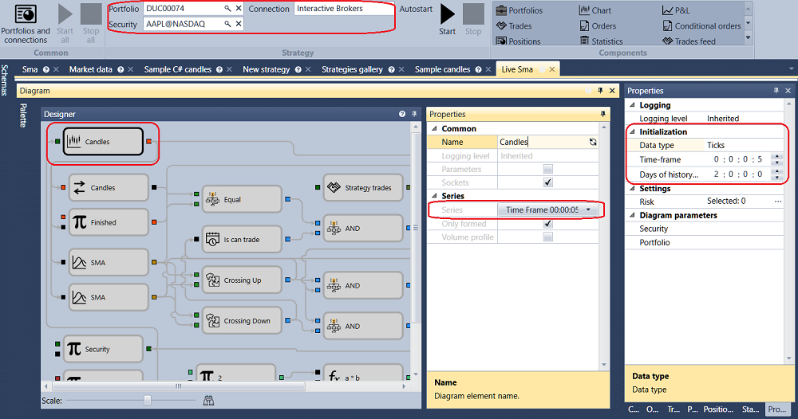

# Ejemplo de ejecución en vivo

Para ejecutar un ejemplo en **En vivo**, necesitará:

1. El terminal de prueba **IB Trader Workstation (TWS) Demo** de [Interactive Brokers](../../api/connectors/stock_market/interactive_brokers.md), que puede obtener en el sitio web del fabricante.

2. Configurar el terminal IB TWS Demo para trabajar con [Designer](../../designer.md). Vea **Ejemplo de configuración de IB TWS** en la sección [Interactive Brokers](../../api/connectors/stock_market/interactive_brokers.md).

3. Configurar la conexión a IB TWS Demo en [Designer](../../designer.md) y conectarse.

4. Descargar el historial del instrumento requerido. Por ejemplo, se usará el instrumento **AAPL@NASDAQ**. La estrategia usará velas con un marco temporal de 5 segundos y el historial no será necesario, pero dicho historial será suficiente para demostrar la posibilidad.

5. Configurar y ejecutar la estrategia.

En el ejemplo con la estrategia SMA se usarán los siguientes parámetros.

- Instrumento **AAPL@NASDAQ**
- Almacenamiento estándar **\\Documents\\StockSharp\\Designer\\Storage**
- Formato de almacenamiento - **CSV**
- Tipo de datos tomado del almacenamiento - **Ticks**
- Velas con marco temporal de 5 s
- Volumen - 100
- Días de historial - 2

Después de configurar todos los parámetros requeridos, inicie el trading en vivo para la estrategia haciendo clic en el botón **Iniciar** .

Después de hacer clic en el botón **Iniciar** , el gráfico empezará a mostrar todo el historial descargado de 2 días:

Después de descargar todo el historial desde el [Almacenamiento de datos de mercado](../market_data_storage.md) y la tabla de operaciones anónimas desde el terminal, la estrategia comenzará a operar.

A continuación se muestran gráficos de [Designer](../../designer.md) y del terminal de trading para el mismo período.

Gráfico de [Designer](../../designer.md):

Gráfico del terminal de trading:

## Véase también

[Almacenamiento de datos de mercado](../market_data_storage.md)
