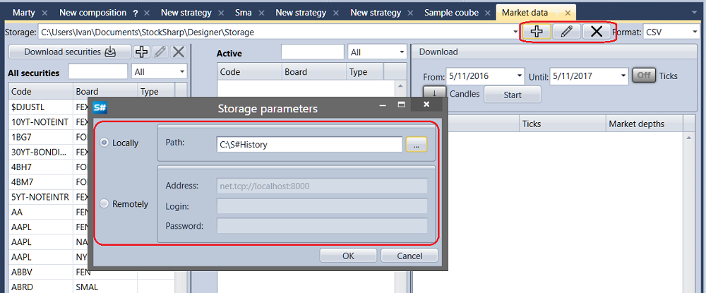

# Primeros pasos

Para crear un almacenamiento de datos históricos, haga clic en el botón  en la pestaña **Datos de mercado**. Haga clic en  para cambiar los parámetros del almacenamiento actual. Haga clic en  para eliminar el almacenamiento actual de la lista de almacenamientos.

El almacenamiento de datos históricos puede ser local o remoto.

Almacenamiento local: cuando todos los datos se guardan en el equipo local. Para configurar el almacenamiento local, basta con especificar la ruta a la carpeta con los datos guardados.

El almacenamiento remoto puede estar ubicado en otro equipo. Para configurarlo, especifique la dirección del almacenamiento remoto y, si es necesario, el usuario y la contraseña.

Puede reproducir el almacenamiento remoto en una máquina local usando el software [Hydra](../../hydra.md) (nombre en clave Hydra), diseñado para cargar automáticamente datos de mercado (instrumentos, velas, operaciones tick, libros de órdenes, etc.) desde distintas fuentes y guardarlos en el almacenamiento local. Para ello, cambie [Hydra](../../hydra.md) al modo servidor.

Después, en [Designer](../../designer.md), cree un nuevo almacenamiento haciendo clic en el botón . En la configuración del almacenamiento, en el campo de dirección, especifique "net.tcp:\/\/localhost:8000". Haga clic en OK. Al usar [Hydra](../../hydra.md) como almacenamiento remoto, no olvide que [Hydra](../../hydra.md) debe iniciarse y configurarse correspondientemente.

Después de añadir un nuevo almacenamiento, puede seleccionarse en la lista desplegable **Almacenamiento**.

También debe seleccionar el formato de los archivos de almacenamiento: BIN o CSV. Los datos pueden guardarse en dos formatos: en un formato binario especial BIN, que proporciona la máxima relación de compresión, o en formato de texto CSV, que es cómodo al analizar datos en otros programas. El formato BIN es preferible cuando se necesita ahorrar espacio en disco. El formato CSV es preferible cuando se necesita ajustar datos manualmente. CSV se edita fácilmente con el bloc de notas estándar, MS Excel, etc.

## Contenido recomendado

[Descargar instrumentos](download_instruments.md)
