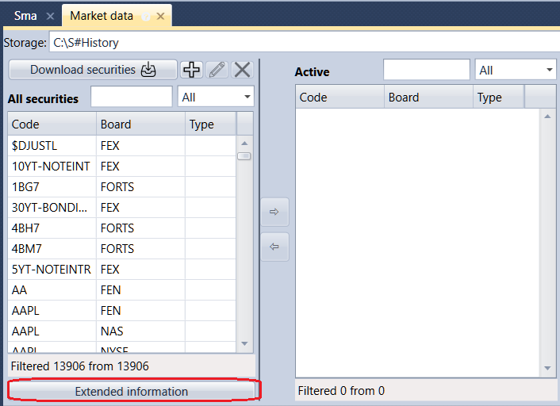

# Información extendida del instrumento

Cualquier información necesaria sobre un instrumento (por ejemplo, país, ciudad, sitio web, etc.) puede ser información extendida.

Para obtener más información sobre la información extendida, consulte la documentación [Información extendida del instrumento](../../hydra/instruments_and_boards/extended_instrument_info.md) en [Hydra](../../hydra.md).
