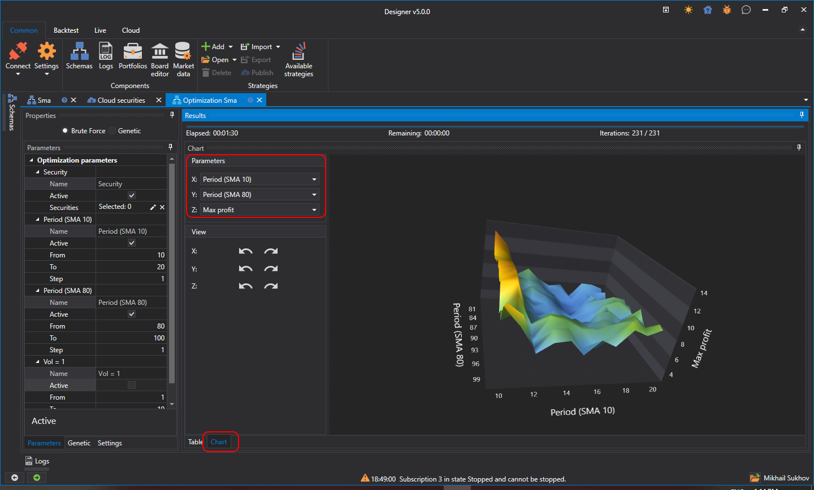

# Informe 3D

Los resultados de la optimización pueden verse como un gráfico 3D. Para ello, en el panel de resultados debe cambiar a la pestaña Gráfico:

El gráfico puede mostrarse en una proyección tridimensional, lo que significa que solo puede acomodar 3 dimensiones. Por lo tanto, si la optimización se realiza sobre 4 o más parámetros, para ver los resultados debe cambiar las dimensiones de X e Y.

La dimensión de Z siempre debe ser numérica, a diferencia de X e Y, donde las dimensiones pueden ser, por ejemplo, por [instrumentos](portfolio_optimization.md).
