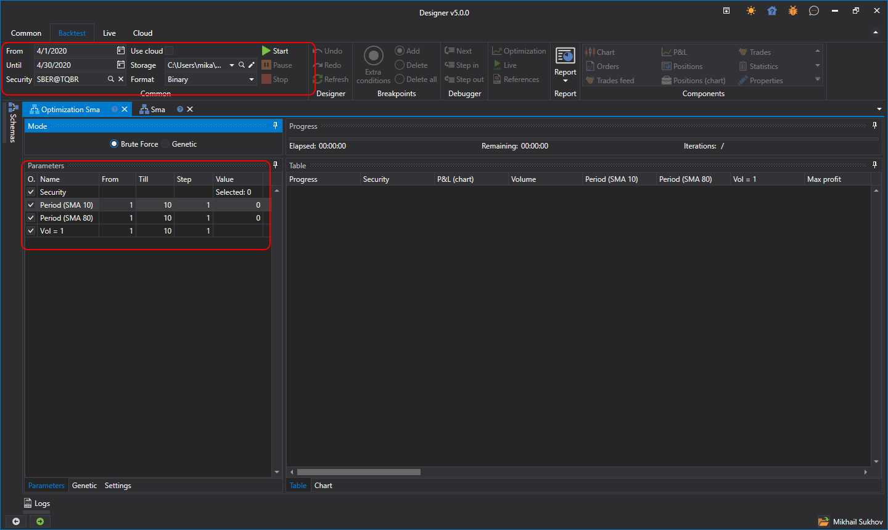

# Fuerza bruta

Para cambiar al modo de optimización de estrategia, haga clic en el botón **Optimización** de la pestaña **Emulación**. El ejemplo de optimización se considerará usando la estrategia SMA creada [a partir de cubos](../strategies/using_visual_designer/first_strategy.md).

Se abrirá una pestaña llamada Optimización + 'Nombre de la estrategia' en el espacio de trabajo. La pestaña **Optimización** está dividida en dos áreas, **Propiedades** y **Resultado de optimización**:

- El área **Propiedades** consta de pestañas con varias tablas. La primera contiene los parámetros de la estrategia, que se [iteran](optimization_parameters.md). La segunda contiene la configuración de [Genética](genetic.md). La tercera contiene los ajustes del sistema del optimizador. Por ejemplo, allí puede cambiar el número de hilos y núcleos implicados en la optimización.
- El área **Resultado de optimización** es una tabla en la que cada fila es el resultado de probar la estrategia con parámetros únicos. Además, en el área **Resultado de optimización** hay una barra de progreso que muestra el progreso de la optimización, el tiempo transcurrido y el tiempo estimado hasta el final de la optimización. También hay una pestaña para mostrar los resultados en forma de [gráfico 3D](3d_chart.md).

Configurar los parámetros para iteración produce más de 1000 iteraciones. Después de iniciar el optimizador, el progreso en la parte superior sobre los resultados mostrará datos sobre el número planificado de iteraciones, cuántas ya se han completado y cuánto tiempo se necesita aproximadamente hasta la finalización:

## Véase también

[Ejemplo de backtesting](../backtesting/getting_started.md)
