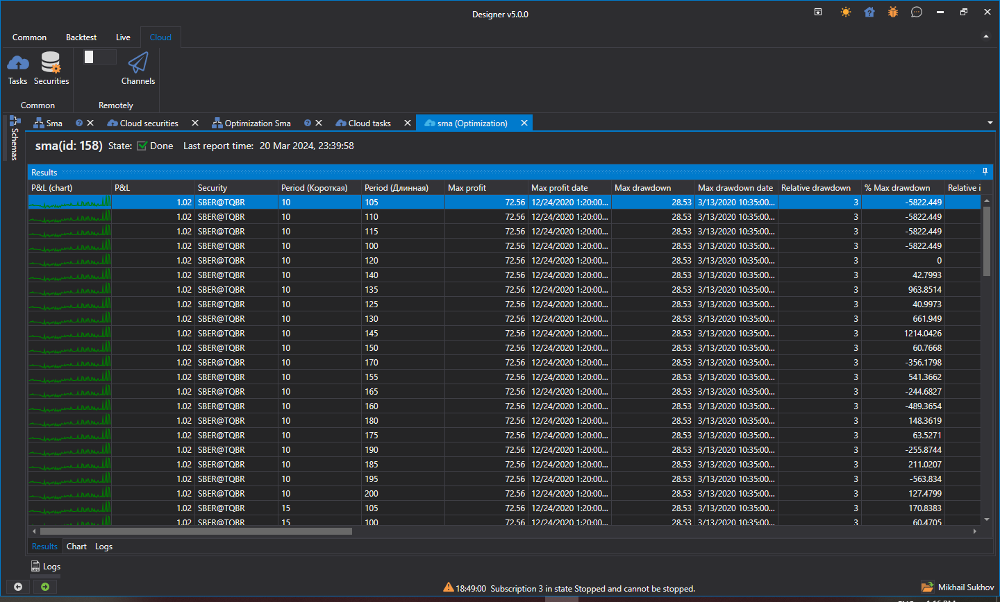

# Optimización en la nube

El proceso de optimización en la nube es similar a las [Pruebas en la nube](../backtesting/cloud_backtesting.md). Los resultados del informe son visualmente similares a la optimización local:

