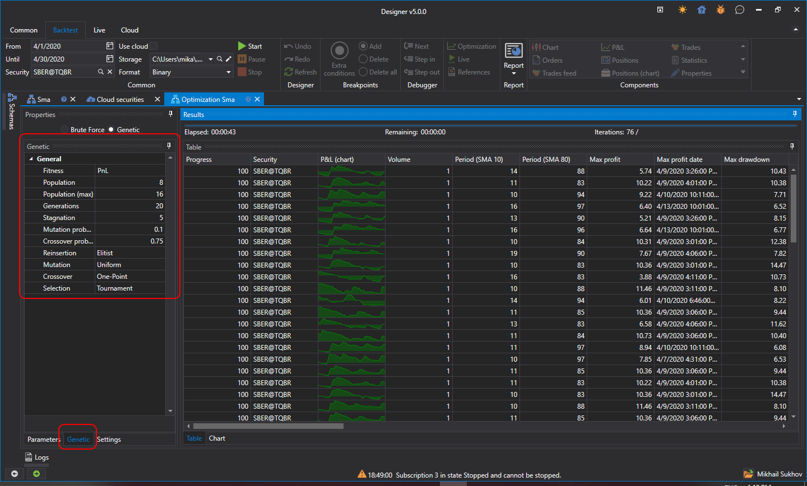

# Genética

**Designer** admite la optimización tanto por el [método de fuerza bruta](brute_force.md) como basada en algoritmos genéticos. La optimización genética acelera significativamente el proceso de búsqueda de parámetros óptimos.

Para habilitar la optimización **Genético**, debe:

- cambiar el modo:

  

- establecer los parámetros de optimización:

  

- como función objetivo (Fitness), puede especificar una fórmula extendida:

  

  Por ejemplo, realizar cálculos no solo por **Beneficio**, sino también en relación con su **Drawdown máximo**. Las funciones matemáticas disponibles son similares a las del bloque [Fórmula](../strategies/using_visual_designer/elements/common/formula.md).

> [!TIP]
> La optimización mediante genética no es determinista. Por lo tanto, determinar el número exacto de iteraciones y, en consecuencia, el tiempo total necesario, es imposible, a diferencia de la [búsqueda por fuerza bruta](brute_force.md).
