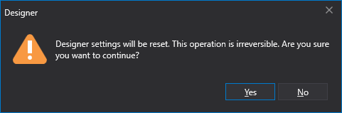

# Restablecer configuración

> [!CAUTION]
> **Antes de restablecer la configuración, lea atentamente esta sección.**

El **Quick access panel** se encuentra de forma predeterminada en la parte superior de la ventana del programa y contiene el botón de configuración . Al hacer clic en , puede cambiar el modo de inicio, cambiar el idioma de la interfaz o restablecer todos los ajustes.

Al seleccionar **Reset settings**, se abre una ventana de confirmación.

Después de hacer clic en **OK**, todos los ajustes se restablecen a sus valores predeterminados. El directorio de configuración del programa se limpia por completo. **Todas las estrategias creadas, instrumentos descargados y demás información almacenada en el directorio de configuración se eliminarán.**
