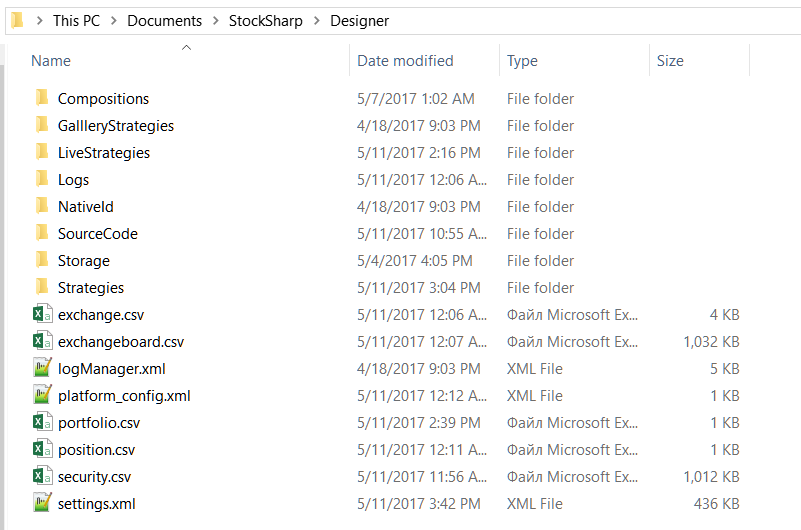

# Directorio de configuración

Los siguientes directorios son importantes para [Designer](../../designer.md):

1. El directorio donde está instalado [Designer](../../designer.md). Desde esta carpeta puede iniciar [Designer](../../designer.md) ejecutando **Designer.exe**, o actualizar [Designer](../../designer.md) ejecutando **Designer.Update.exe**. Eliminar este directorio elimina [Designer](../../designer.md), pero no elimina la configuración de [Designer](../../designer.md).

2. El directorio de configuración de **Designer** se encuentra bajo la carpeta de documentos del usuario: …\\StockSharp\\Designer\\ (por ejemplo, c:\\Users\\User\\Documents\\StockSharp\\Designer\\). Eliminar este directorio restablece toda la configuración de [Designer](../../designer.md) a sus valores predeterminados. **Todas las estrategias creadas, instrumentos descargados y demás información almacenada en el directorio de configuración serán DESTRUIDOS.**

Este directorio contiene las siguientes carpetas y archivos:

- **Compositions** almacena, como archivos XML, todos los bloques de la carpeta **Elementos compuestos** del panel [Schemas](../user_interface/schemas.md). Eliminar archivos de este directorio elimina el **Elemento compuesto** correspondiente de la carpeta **Elementos compuestos** del panel [Schemas](../user_interface/schemas.md). No edite estos archivos manualmente; hacerlo puede romper el bloque **Elementos compuestos** correspondiente.
- **LiveStrategies** almacena, como archivos XML, todos los bloques de la carpeta **Operaciones** del panel [Schemas](../user_interface/schemas.md). Eliminar archivos de este directorio elimina la estrategia de la carpeta **Operaciones** del panel [Schemas](../user_interface/schemas.md). No edite estos archivos manualmente; hacerlo puede romper la estrategia correspondiente.
- **Registros** contiene todos los registros de fallos de [Designer](../../designer.md), lo que simplifica la solución de problemas de [Designer](../../designer.md).
- **SourceCode** almacena, como archivos XML, todos los bloques de la carpeta **Código fuente** del panel [Schemas](../user_interface/schemas.md). Eliminar archivos de este directorio elimina el bloque **Código fuente** de la carpeta **Código fuente** del panel [Schemas](../user_interface/schemas.md). No edite estos archivos manualmente; hacerlo puede romper el bloque **Código fuente** correspondiente.
- **Estrategias** almacena, como archivos XML, todos los bloques de la carpeta **Estrategias** del panel [Schemas](../user_interface/schemas.md). Eliminar archivos de este directorio elimina la estrategia de la carpeta **Estrategias** del panel Schemas. No edite estos archivos manualmente; hacerlo puede romper la estrategia correspondiente. Si añade manualmente un archivo de estrategia a esta carpeta y reinicia [Designer](../../designer.md), la estrategia aparecerá en la carpeta **Estrategias** del panel [Schemas](../user_interface/schemas.md).
- **Almacenamiento** contiene datos de mercado descargados por [Designer](../../designer.md) en el [Almacenamiento de datos de mercado](../market_data_storage.md) correspondiente. La carpeta se crea al crear el [Almacenamiento de datos de mercado](../market_data_storage.md), y la ruta predeterminada apunta a esta carpeta. Eliminar esta carpeta elimina todos los datos de mercado descargados del almacenamiento correspondiente. Si el almacenamiento contiene archivos CSV, pueden editarse en un editor de texto estándar o MS Excel. Los archivos BIN no pueden editarse manualmente.
- **exchange.csv** y **exchangeboard.csv** contienen la lista de **bolsas**, códigos de instrumentos y modos de trading. Estos archivos pueden editarse en un editor de texto estándar o MS Excel.
- **security.csv** contiene todos los instrumentos recibidos y creados en todas las fuentes. Eliminar este archivo elimina todos los instrumentos de [Designer](../../designer.md). La adición de nuevos instrumentos se describe en [Descargar instrumentos](../market_data_storage/download_instruments.md) y [Crear instrumento](../market_data_storage/create_instrument.md). Este archivo puede editarse en un editor de texto estándar o MS Excel.
- **portfolio.csv** y **position.csv** contienen todas las carteras recibidas y creadas y sus posiciones actuales. Eliminar estos archivos elimina los datos correspondientes de [Designer](../../designer.md). Si [Designer](../../designer.md) recibe información de cartera en cada conexión, la información de posiciones todavía puede perderse permanentemente. Estos archivos pueden editarse en un editor de texto estándar o MS Excel.
- **settings.json** contiene la configuración actual. [Designer](../../designer.md) crea este archivo cuando cambia la configuración o al cerrar el programa. Eliminar este archivo restablece la configuración actual a valores predeterminados. No edite este archivo manualmente; hacerlo puede romper [Designer](../../designer.md).

Antes de editar manualmente archivos individuales o restablecer la configuración de [Designer](../../designer.md), haga copias de seguridad de los archivos que cambie o de todo el directorio.

## Véase también

[Actualizar a la nueva versión](../update_to_the_new_version.md)
