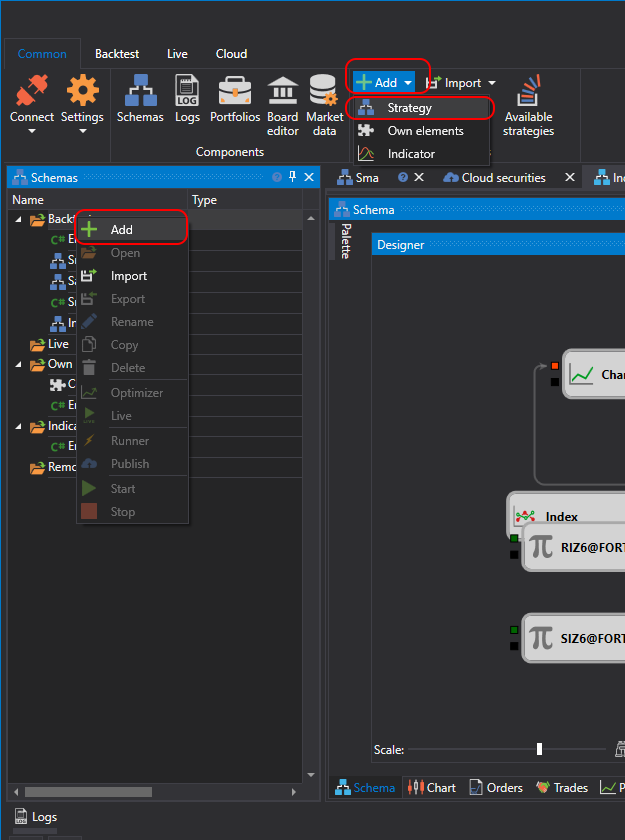

# Uso de C#

La creación de estrategias desde código está pensada para usuarios que prefieren trabajar con código C#. Estas estrategias, a diferencia de los diagramas, no están limitadas en capacidades, y puede describirse cualquier algoritmo.

El proceso de creación de una estrategia se realiza directamente en [Designer](../../../designer.md) o en un entorno de desarrollo **C#** (los más populares son **Visual Studio** y **JetBrains Rider**), usando una biblioteca para el desarrollo profesional de robots de trading en **C#** y la [API](../../../api.md).

Puede añadir una nueva estrategia pulsando el botón **Añadir**  en la pestaña **Común** y eligiendo **Estrategia**. O bien haciendo clic con el botón derecho en la carpeta **Estrategias** del panel **Esquema** y pulsando el botón **Añadir**  en el menú desplegable:

Después de pulsar el botón **Añadir** , aparecerá una ventana con la elección del tipo de contenido para crear la estrategia:

Para crear una estrategia desde código C#, debe seleccionar la segunda pestaña. También puede elegir una plantilla que se usará como código inicial.

Después de pulsar **Aceptar**, aparecerá una nueva estrategia en la carpeta **Estrategias** del panel **Esquema**, igual que al crear una estrategia desde [diagramas](../using_visual_designer.md). Las acciones para eliminar o renombrar la estrategia son similares.

Pero en lugar de un diagrama, se mostrará un editor de código C#:

La pestaña del editor de código consta de los paneles **Código fuente** y **Lista de errores**. El panel **Código fuente** contiene el propio editor de código C#. En la parte superior hay una barra de herramientas donde puede activar o desactivar el resaltado de elementos como **Línea actual**, **Número de línea**, etc. Para aumentar el tamaño de fuente, puede usar la combinación CTRL+MouseWheel.

El panel **Lista de errores** es una tabla con la lista de errores en el código; al hacer doble clic en una fila, el cursor se moverá automáticamente en el panel **Código fuente** a la ubicación del error.

Al editar el código, aparecerá un icono  en la esquina inferior derecha del panel **Lista de errores**, indicando que ha comenzado el seguimiento de cambios. El código se compila en el momento en que deja de cambiar.

La ejecución de la estrategia en [backtest](../../backtesting/user_interface.md), en [live](../../live_execution/getting_started.md) y otras operaciones son similares a las de una estrategia creada a partir de diagramas.
