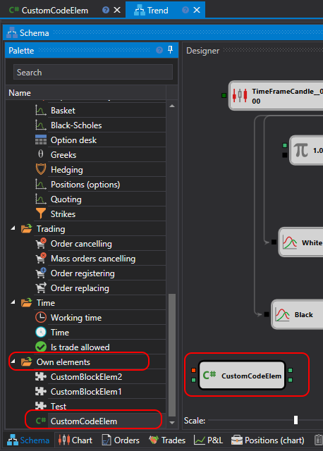

# Crear su propio cubo

De forma similar a la creación de un [cubo a partir de un diagrama](../../using_visual_designer/composite_elements.md), puede crear su propio cubo basado en código C#. Este cubo será más funcional que un cubo creado a partir de un diagrama.

Para crear un cubo desde código, debe crearse en la carpeta **Elementos propios**:


En el ejemplo que se muestra a continuación, el cubo hereda de la clase [DiagramExternalElement](xref:StockSharp.Diagram.DiagramExternalElement) y tiene este aspecto:

```cs
/// <summary>
/// Elemento de diagrama de ejemplo que demuestra el uso de conectores de entrada y salida.
///
/// https://doc.stocksharp.com/topics/Designer_Combine_Source_code_and_standard_elements.html
/// </summary>
public class EmptyDiagramElement : DiagramExternalElement
{
	private readonly DiagramElementParam<int> _minValue;

	public EmptyDiagramElement()
	{
		// propiedad de ejemplo para mostrar cómo crear parámetros

		_minValue = AddParam("MinValue", 10)
			.SetBasic(true) // hacer visible el parámetro en modo básico
			.SetDisplay("Parámetros", "Valor mínimo", "Descripción del parámetro de valor mínimo", 10);
	}

	// los conectores de salida son eventos marcados con el atributo DiagramExternal

	[DiagramExternal]
	public event Action<Unit> Output1;

	[DiagramExternal]
	public event Action<Unit> Output2;

	// los conectores de entrada son parámetros de método marcados con el atributo DiagramExternal

	// descomente para que el método Process se llame cada vez que se recibe un nuevo argumento
	// (no es necesario esperar a que se reciban todos los argumentos de entrada)
	//public override bool WaitAllInput => false;

	[DiagramExternal]
	public void Process(CandleMessage candle, Unit diff)
	{
		var res = candle.ClosePrice + diff;

		if (diff >= _minValue.Value)
			Output1?.Invoke(res);
		else
			Output2?.Invoke(res);
	}

	public override void Start()
	{
		base.Start();

		// añadir lógica antes del inicio
	}

	public override void Stop()
	{
		base.Stop();

		// añadir lógica después de detener
	}

	public override void Reset()
	{
		base.Reset();

		// añadir lógica para restablecer el estado interno
	}
}
```

En este código, el cubo tiene dos conectores de entrada y dos conectores de salida. Los conectores de entrada se definen aplicando el atributo [DiagramExternalAttribute](xref:StockSharp.Diagram.DiagramExternalAttribute) al método:

```cs
[DiagramExternal]
public void Process(CandleMessage candle, Unit diff)
```

Los conectores de salida se definen aplicando el atributo a un evento. En el ejemplo del cubo hay dos eventos de este tipo:


```cs
[DiagramExternal]
public event Action<Unit> Output1;

[DiagramExternal]
public event Action<Unit> Output2;
```

Por lo tanto, también habrá dos conectores de salida.

Además, se muestra cómo crear una propiedad para el cubo:

```cs
_minValue = AddParam("MinValue", 10)
	.SetBasic(true) // hacer visible el parámetro en modo básico
	.SetDisplay("Parámetros", "Valor mínimo", "Descripción del parámetro de valor mínimo", 10);
```

El uso de la clase [DiagramElementParam](xref:StockSharp.Diagram.DiagramElementParam`1) aplica automáticamente el enfoque para guardar y restaurar la configuración.

La propiedad **Valor mínimo** está marcada como básica y será visible en el modo de [propiedades básicas](../../using_visual_designer/diagram_panel.md).

La propiedad comentada [WaitAllInput](xref:StockSharp.Diagram.DiagramExternalElement.WaitAllInput) es responsable del momento de llamada del método con conectores de entrada:

```cs
//public override bool WaitAllInput => false;
```

Si se descomenta, el método **Proceso** se llamará siempre en cuanto llegue al menos un valor (en el ejemplo, una vela o un valor numérico).

Para añadir el cubo resultante al diagrama, debe seleccionar el cubo creado en la paleta, en la sección **Elementos propios**:



> [!WARNING]
> Los cubos creados con código C# no pueden usarse en estrategias creadas con código C#. Solo pueden usarse en estrategias creadas [a partir de cubos](../../using_visual_designer.md).

## Véase también

[Creación de un indicador](create_own_indicator.md)
