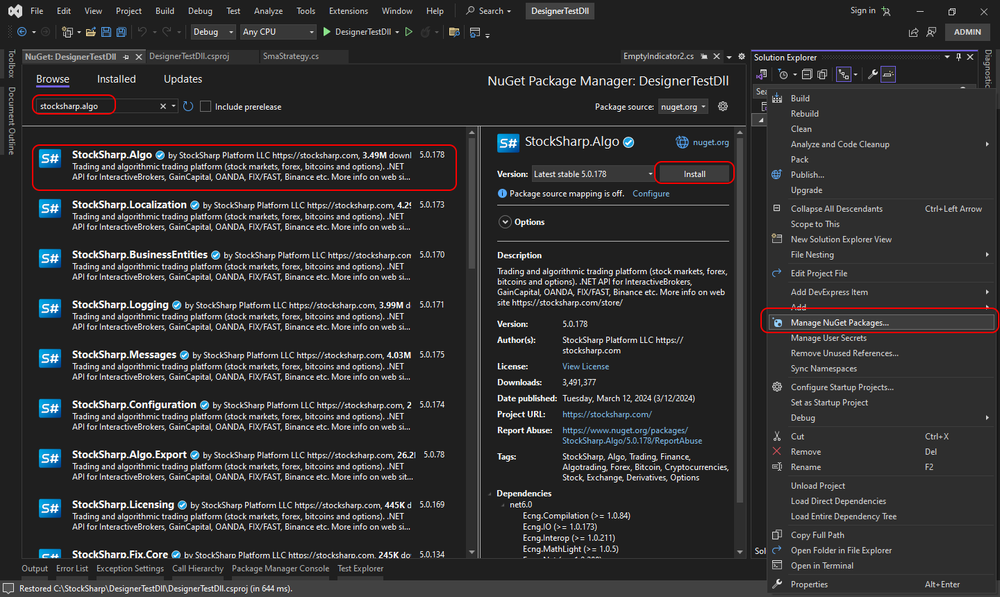

# Uso de DLL

El uso de DLL listas resulta familiar para quienes desean trabajar continuamente en entornos **Visual Studio** y **JetBrains Rider**. Este enfoque ofrece varias ventajas frente a escribir [código](using_code.md) dentro de **Designer**:

- Editor de código mejorado en comparación con el editor integrado dentro de **Designer**.
- Al recompilar el código, el contenido dentro de **Designer** se actualiza automáticamente.
- Posibilidad de dividir el código en varios archivos (en el enfoque de [código](using_code.md), solo es posible la variante OneFile-OneStrategy).
- Uso del [depurador](using_dll/debug_dll_in_visual_studio.md).

### Crear un proyecto en Visual Studio

1. Para crear una estrategia en **Visual Studio**, debe crear un proyecto:

2. A continuación, debe escribir el código de la estrategia. Para un inicio rápido, puede copiar el código de SmaStrategy, que se crea como plantilla en [estrategia desde código](using_code/csharp/first_strategy.md):

3. Para compilar el código, incluya el paquete NuGet [StockSharp.Algo](https://www.nuget.org/packages/stocksharp.algo), que contiene la clase base para todas las estrategias: [Strategy](xref:StockSharp.Algo.Strategies.Strategy).

Si la estrategia usa interfaces de gráficos, incluya el paquete NuGet [StockSharp.Charting.Interfaces](https://www.nuget.org/packages/stockSharp.charting.interfaces). Estas interfaces no contienen la lógica real de gráficos y solo son necesarias para compilar el código. Cuando la estrategia se ejecuta en **Designer**, el renderizado real de gráficos ocurre mediante estas interfaces.

4. Después de crear la estrategia, el proyecto debe compilarse pulsando **Compilar solución** en la pestaña **Compilar**.

5. En Visual Studio, de forma predeterminada, el proyecto se compila en la carpeta …\\bin\\Debug\\net6.0.

### Añadir DLL a Designer

1. Añadir una estrategia desde una DLL es similar a crear una estrategia desde [código](using_code.md). Pero en la etapa de definición del tipo de contenido debe elegir **DLL**:

2. En la ventana debe especificar la ruta al ensamblado (debe ser compatible con .NET 6.0) y elegir el tipo. Esto último es necesario porque una DLL puede contener varias estrategias (o [cubos con indicadores](using_dll/create_element_and_indicator.md)). Después de hacer clic en **Aceptar**, la estrategia se añadirá al panel **Esquema** y estará lista para usarse:

3. La ejecución de la estrategia en [backtest](../backtesting/user_interface.md), en [live](../live_execution/getting_started.md) y otras operaciones funciona de forma similar a una estrategia creada desde diagramas y código:

