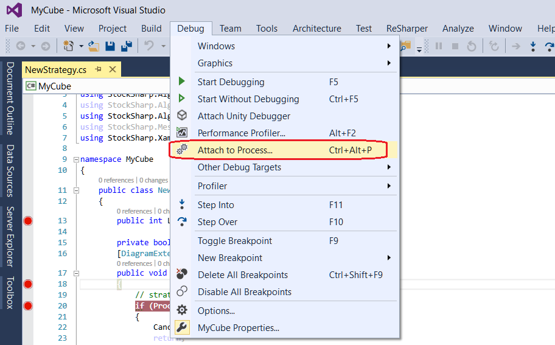
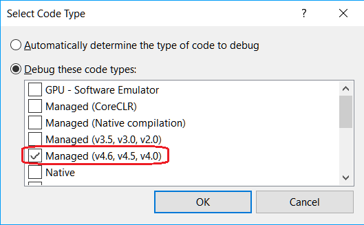

# Depuración de una DLL con Visual Studio

Visual Studio proporciona un mecanismo para adjuntarse a procesos en ejecución mediante el depurador de Visual Studio. El depurador de Visual Studio se describe con más detalle en la documentación [Attach to running processes](https://learn.microsoft.com/en-us/visualstudio/debugger/attach-to-running-processes-with-the-visual-studio-debugger?view=vs-2022). El proceso de depuración se demostrará con el ejemplo de una estrategia añadida en la sección [Uso de DLL](../using_dll.md).

1. Para adjuntarse a un proceso e iniciar la depuración de una estrategia DLL, debe estar cargada en memoria. La DLL se carga en memoria después de [añadir la estrategia](../using_dll.md). Una vez cargada la DLL en memoria, puede adjuntarse al proceso.

2. En Visual Studio, seleccione **Debug -> Attach to Process**.

3. En el cuadro de diálogo **Attach to Process**, busque el proceso **Designer.exe** en la lista **Available processes** al que desea adjuntarse.

Si el proceso se ejecuta bajo otra cuenta de usuario, debe marcar la casilla **Show processes from all users**.

4. Es importante que la ventana **Attach to** especifique el tipo de código que debe depurarse. El parámetro predeterminado **Auto** intenta determinar el tipo de código que se debe depurar, pero no siempre identifica correctamente el tipo de código. Para establecer manualmente el tipo de código, debe realizar los siguientes pasos.

- En el campo Attach to, haga clic en **Select**.
- En el cuadro de diálogo **Select Code Type**, haga clic en el botón **Debug these code types** y seleccione los tipos para depuración.
- Haga clic en OK.

5. Haga clic en el botón Attach.

6. En Visual Studio, establezca puntos de interrupción en el código. Si los puntos de interrupción son rojos y están rellenos de rojo  (y Studio está en modo de depuración), significa que se cargó la versión exacta de la DLL. Si los puntos de interrupción son rojos y están rellenos de blanco  (y Studio está en modo de depuración), significa que se cargó una versión incorrecta de la DLL.

7. En el ejemplo, el punto de interrupción se establece en la primera línea del método **public void ProcessCandle(Candle candle)**. Cuando la estrategia se ejecuta en [Designer](../../../designer.md), en cuanto los valores de velas comiencen a pasarse a la DLL, Visual Studio se detendrá en el punto de interrupción. Desde allí, puede seguir la ejecución del código:

> [!WARNING] 
> Cuando el código se detiene bajo el depurador, todos los procesos dentro del programa **Designer** se suspenden. Si el programa está conectado a trading real, en caso de una detención prolongada bajo el depurador se producirán desconexiones.

## Véase también

[Exportación de estrategias](../../export_import/export.md)
